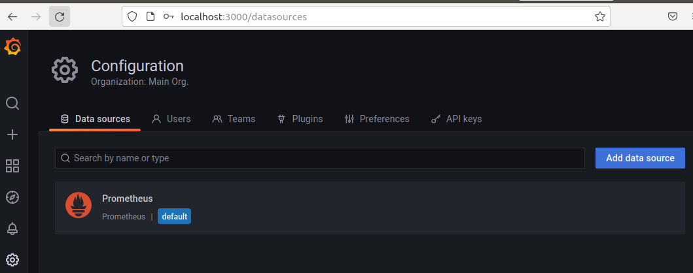
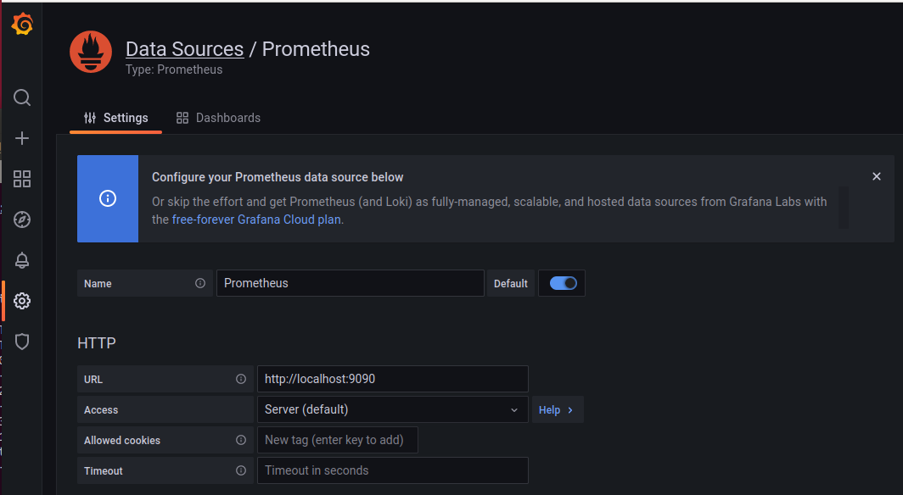
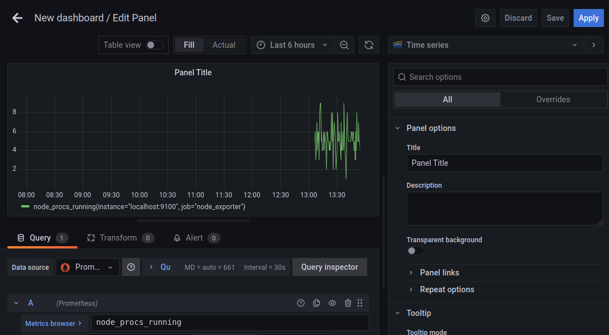
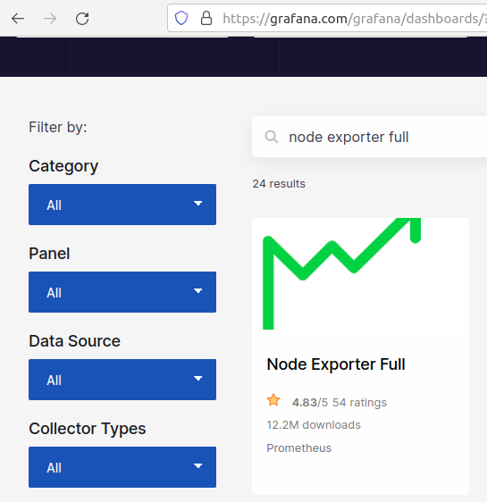
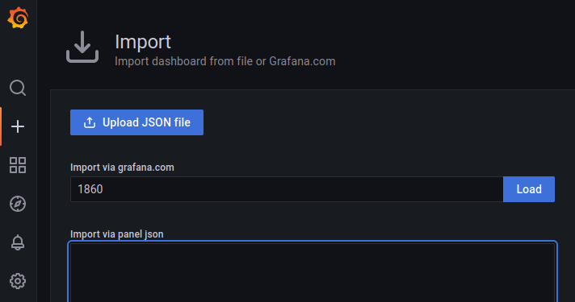
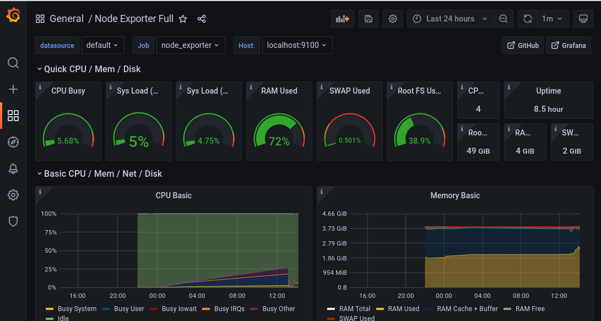
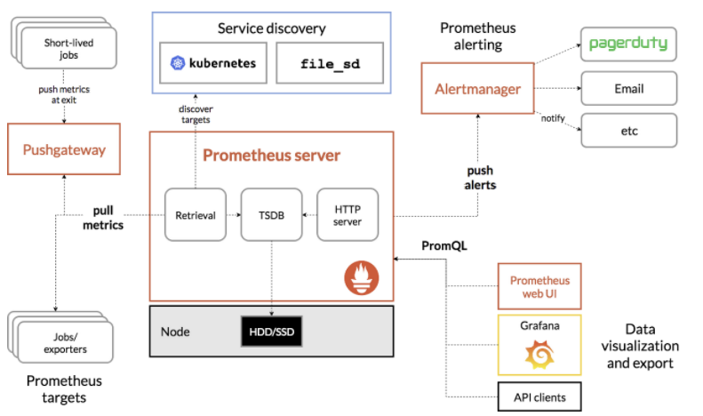

# Prometheus

### install

1. install prometheus

   https://prometheus.io/download/

2. install exporters

   * node_exporter
   * apache_exporter  : https://github.com/Lusitaniae/apache_exporter

3. Grafana
   https://grafana.com/docs/grafana/latest/installation/debian/


#### 1. Download

```sh
$ wget https://github.com/prometheus/prometheus/releases/download/v2.33.4/prometheus-2.33.4.linux-amd64.tar.gz
$ wget https://github.com/prometheus/node_exporter/releases/download/v1.3.1/node_exporter-1.3.1.linux-amd64.tar.gz
$ gunzip *.gz
$ tar xvf node_exporter-1.3.1.linux-amd64.tar
$ tar xvf prometheus-2.33.4.linux-amd64.tar
```

#### 2. 설치

```sh
$ sudo mkdir -p /usr/local/prometheus
$ sudo mv console_libraries/ consoles/ prometheus /usr/local/prometheus/
$ sudo mv prometheus.yml /usr/local/prometheus/

$ sudo groupadd --system prometheus
$ sudo useradd --system -s /usr/sbin/nologin -g prometheus prometheus

$ sudo  chown -R  prometheus:prometheus /usr/local/prometheus
# mkdir  -p /var/lib/prometheus/
# chown  prometheus:prometheus /var/lib/prometheus/
```

#### 3. 설정

##### prometheus 

```sh
cat /etc/systemd/system/prometheus.service 
[Unit]
Description=Prometheus
Wants=network-online.target
After=network-online.target

[Service]
User=prometheus
Restart=on-failure
ExecStart=/usr/local/prometheus/prometheus \
	--config.file=/usr/local/prometheus/prometheus.yml \
	--storage.tsdb.path=/var/lib/prometheus/ \
	--web.console.templates=/usr/prometheus/console \
	--web.console.libraries=/usr/prometheus/console_libraries \
	--web.listen-address=0.0.0.0:9090 \
	--web.external-url=

[Install]
WantedBy=multi-user.target

$ systemctl daemon-reload
$ systemctl start prometheus
$ journalctl -xe
```

* 확인:  http://localhost:9090


##### node exporter

```
# mkdir -p  /usr/local/prometheus/exporters
# chown -R prometheus:prometheus /usr/local/prometheus/exporters/
$ sudo mv node_exporter  /usr/local/prometheus/exporters/
```

```sh
# cat  node_exporter.service 
[Unit]
Description=Prometheus - node_exporter
Wants=network-online.target
After=network-online.target

[Service]
User=prometheus
Restart=on-failure
ExecStart=/usr/local/prometheus/exporters/node_exporter 

[Install]
WantedBy=multi-user.target

# systemctl daemon-reload
# systemctl start node_exporter.service 
# systemctl status  node_exporter.service
$ journalctl -xe
```

* 확인: http://localhost:9100/metrics

##### prometheus.yaml

```yaml
scrape_configs:
  # The job name is added as a label `job=<job_name>` to any timeseries scraped from this config.
  - job_name: "prometheus"

    # metrics_path defaults to '/metrics'
    # scheme defaults to 'http'.

    static_configs:
      - targets: ["localhost:9090"]

  - job_name: "node_exporter"
    static_configs: 
      - targets: ["localhost:9100"]

```


#### 4. Grafana

install the latest OSS release

```sh
$ sudo apt-get install -y apt-transport-https
$ sudo apt-get install -y software-properties-common wget
$ wget -q -O - https://packages.grafana.com/gpg.key | sudo apt-key add -
$ echo "deb https://packages.grafana.com/oss/deb stable main" | sudo tee -a /etc/apt/sources.list.d/grafana.list
$ sudo apt-get update
$ sudo apt-get install grafana

$ sudo systemctl daemon-reload
$ sudo systemctl enable grafana-server
$ sudo systemctl start grafana-server

```

##### grafana-server.service

```sh
# cat grafana-server.service 
[Unit]
Description=Grafana instance
Documentation=http://docs.grafana.org
Wants=network-online.target
After=network-online.target
After=postgresql.service mariadb.service mysql.service

[Service]
EnvironmentFile=/etc/default/grafana-server
User=grafana
Group=grafana
Type=simple
Restart=on-failure
WorkingDirectory=/usr/share/grafana
RuntimeDirectory=grafana
RuntimeDirectoryMode=0750
ExecStart=/usr/sbin/grafana-server                                                  \
                            --config=${CONF_FILE}                                   \
                            --pidfile=${PID_FILE_DIR}/grafana-server.pid            \
                            --packaging=deb                                         \
                            cfg:default.paths.logs=${LOG_DIR}                       \
                            cfg:default.paths.data=${DATA_DIR}                      \
                            cfg:default.paths.plugins=${PLUGINS_DIR}                \
                            cfg:default.paths.provisioning=${PROVISIONING_CFG_DIR}  


LimitNOFILE=10000
TimeoutStopSec=20
CapabilityBoundingSet=
DeviceAllow=
LockPersonality=true
MemoryDenyWriteExecute=false
NoNewPrivileges=true
PrivateDevices=true
PrivateTmp=true
ProtectClock=true
ProtectControlGroups=true
ProtectHome=true
ProtectHostname=true
ProtectKernelLogs=true
ProtectKernelModules=true
ProtectKernelTunables=true
ProtectProc=invisible
ProtectSystem=full
RemoveIPC=true
RestrictAddressFamilies=AF_INET AF_INET6 AF_UNIX
RestrictNamespaces=true
RestrictRealtime=true
RestrictSUIDSGID=true
SystemCallArchitectures=native
UMask=0027

[Install]
WantedBy=multi-user.target
```

##### localhost:3000

* admin/admin
* passwd 변경

#### 5. Grafana 연결

##### configuration




* Data Source 설정 : URL http://localhost:9090  입력




* data source: Prometheus에서  Metrics browser 설정




#### 6. Grafana dashboard 연동

https://grafana.com/grafana/dashboards/

##### node exporter full 다운로드

 

* import dash board



* 결과




```sh
(((count(count(node_cpu{}) by (cpu))) 
- avg(sum by (mode)(rate(node_cpu{}[$])))) * 100) / count(count(node_cpu{}) by (cpu))
```


### Prometheus

프로메테우스는 2012년 sound Cloud에서 만든 오픈소스 시스템 모니터링 툴이다. 시계열 메트릭 데이터를 수집 및 모니터링 기능이다.

#### 특징

* 메트릭 이름 및 key/value 쌍으로 식별되는 시계열 데이터가 있는 다차원 데이터 모델
* 다차원 데이터 모델에서 사용하는 쿼리 언어는 PromQL
* 시계열 수집은 http를 통한 pull 방식으로 수집
* push 방식의 수집은 gateway를 통해 지원됨
* 다양한 그래프 및 대시보드 지원

#### 아키텍처



#### 구성

* Prometheus server : 시계열 데이터 수집 및 저장하는 메인 서버
* Client libraries: 어플리케이션을 계측하기 위한 라이브러리


### node exporter

* github:  https://github.com/prometheus/node_exporter


#### Prometheus Metric type

prometheus에서 메트릭을 수집하는 방법은 

* Client Library를 통한 metric 수집
* Exporter를 통한 metric 수집

> 메트릭이란?
>
> 메트릭이란 수집하는 시계열 데이터를 일컫는 말이다.

수집되는 메트릭 type

* Counter
* Gauge
* Summary
* Histogram

##### Counter

`Counter` 타입은 가장 많이 수집되는 유형의 메트릭 타입이다. 이 타입은 모니터링하는 이벤트의 누적 개수 혹은 크기를 표현한다. 일반적으로 이 타입은 `rate` 함수와 같이 사용하여, 다음 이벤트를 추적하는데 많이 사용된다.

- 초당 요청 개수
- 초당 상태 코드 개수
- 초당 요청 실패율
- 초당 요청 성공률


#### Client library 이용한  수집

```go
package main

import (
    "fmt"
    "html"
    "net/http"
    "time"

    "github.com/prometheus/client_golang/prometheus"
    "github.com/prometheus/client_golang/prometheus/promauto"
    "github.com/prometheus/client_golang/prometheus/promhttp"
)

var (
    COUNTER = promauto.NewCounter(prometheus.CounterOpts{
        Name: "hello_world_total",
        Help: "Hello World requested",
    })

    GAUGE = promauto.NewGauge(prometheus.GaugeOpts{
        Name: "hello_world_connection",
        Help: "Number of /gauge in progress",
    })

    SUMMARY = promauto.NewSummary(prometheus.SummaryOpts{
        Name: "hello_world_latency_seconds",
        Help: "Latency Time for a request /summary",
    })

    HISTOGRAM = promauto.NewHistogram(prometheus.HistogramOpts{
        Name:    "hello_world_latency_histogram",
        Help:    "A histogram of Latency Time for a request /histogram",
        Buckets: prometheus.LinearBuckets(0.1, 0.1, 10),
    })
)

func index(w http.ResponseWriter, r *http.Request) {
    COUNTER.Inc()
    fmt.Fprintf(w, "Hello, %q", html.EscapeString(r.URL.Path))
}

func gauge(w http.ResponseWriter, r *http.Request) {
    GAUGE.Inc()
    defer GAUGE.Dec()
    time.Sleep(10 * time.Second)
    fmt.Fprintf(w, "Gauge, %q", html.EscapeString(r.URL.Path))
}

func summary(w http.ResponseWriter, r *http.Request) {
    start := time.Now()
    defer SUMMARY.Observe(float64(time.Now().Sub(start)))
    fmt.Fprintf(w, "Summary, %q", html.EscapeString(r.URL.Path))
}

func histogram(w http.ResponseWriter, r *http.Request) {
    start := time.Now()
    defer HISTOGRAM.Observe(float64(time.Now().Sub(start)))
    fmt.Fprintf(w, "Histogram, %q", html.EscapeString(r.URL.Path))
}

func main() {
    http.HandleFunc("/", index)
    http.HandleFunc("/gauge", gauge)
    http.HandleFunc("/summary", summary)
    http.HandleFunc("/histogram", histogram)
    http.Handle("/metrics", promhttp.Handler())
    http.ListenAndServe(":2112", nil)
}
```


#### Counter

`Counter` 타입은 가장 많이 수집되는 유형의 메트릭 타입이다. 이 타입은 모니터링하는 이벤트의 누적 개수 혹은 크기를 표현한다. 일반적으로 이 타입은 `rate` 함수와 같이 사용하여, 다음 이벤트를 추적하는데 많이 사용된다.

- 초당 요청 개수
- 초당 상태 코드 개수
- 초당 요청 실패율
- 초당 요청 성공률

위 애플리케이션에서 `Counter` 타입에 대한 부분은 다음과 같다.


#### ubuntu go install

* Download go

```
$ wget https://go.dev/dl/go1.17.7.linux-amd64.tar.gz
$ rm -rf /usr/local/go && tar -C /usr/local -xzf go1.17.7.linux-amd64.tar.gz
.profile add
$ export PATH=$PATH:/usr/local/go/bin
```

* go 설정 :  GOPATH, GOROOT 확인

```
$ go version
$ go env
$ mkdir -p ~/go/src/dev
$ cd ~/go/src/dev
$ go mod init
$ go build -mod vendor main.go
```


