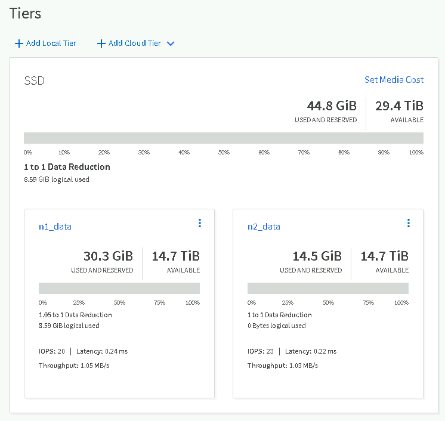
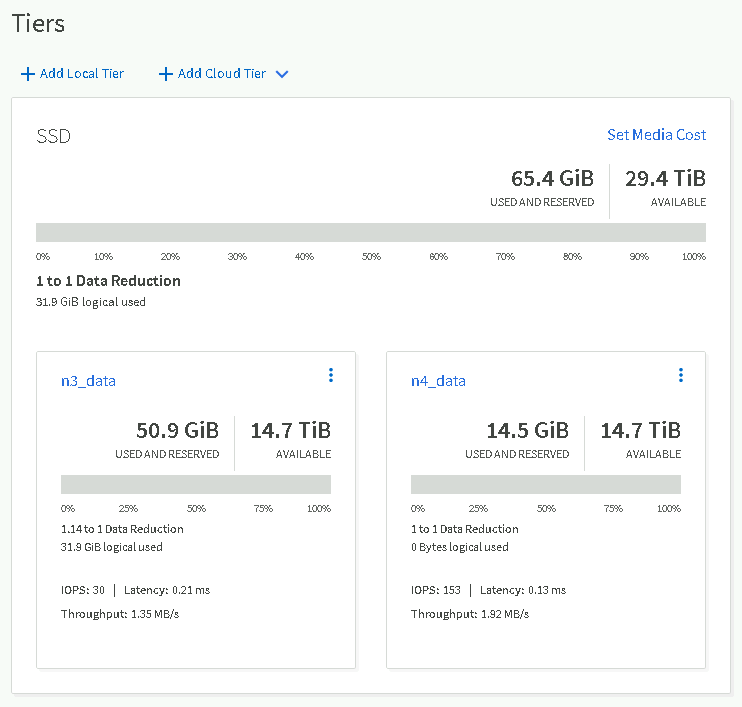
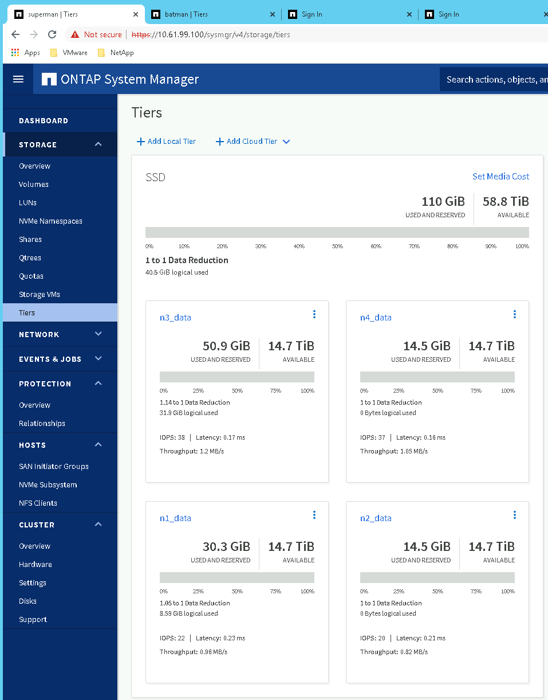
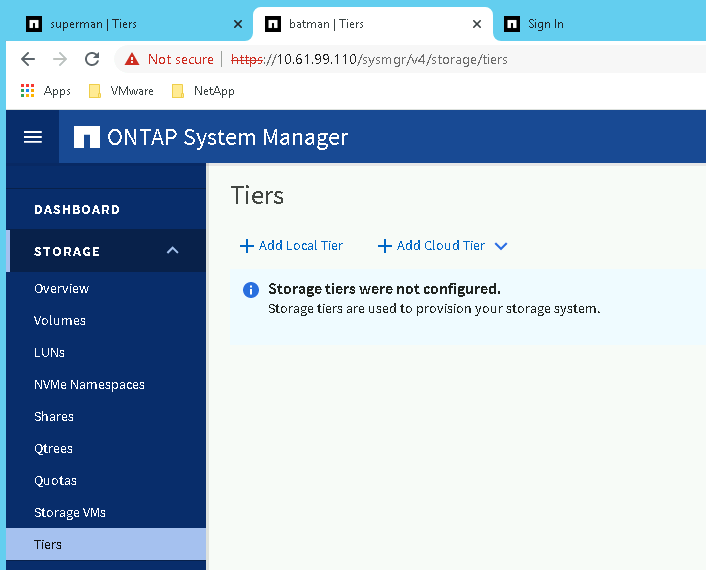

# Metro cluster


```
 How to access the environment:
 a.        
 b.        
 c.        
 d.        

Servers:
vcenter.cpoc.local (make sure to add this to your local hosts file) – 10.61.99.150 – Administrator@vsphere.local (Password is Cpoc4449!) 
esx1 – 10.61.99.151 (if you want to ssh to it) – ssh root@10.61.99.151 – (Password is Cpoc4449!)
esx2 – 10.61.99.152 (if you want to ssh to it) – ssh root@10.61.99.152 – (Password is Cpoc4449!)

NetApp:
superman – 10.61.99.100 (n1 and n2) – admin/cpoc4449
batman – 10.61.99.110 (n3 and n4) – admin/cpoc4449

Notes:
1.  Aiming to simplify the configuration, we already created and configured the MetroCluster using the SVM db1 (superman side) and db2 (batman side)
2.  You can see there are LIFs already created for NFS and CIFS.
3.  Both SVMs are already configured for NFSv3 and CIFS (already added to the Active Directory domain)
4.  You can see there are already created two volumes for ESX – (i1 – in node n1 superman) ::: (i3 – in node n3 batman) – datastores in VMware (NFS)
5.  In ESX, we have two vmkernels. vmk0 is management and CIFS (10.61.99.x) and vmk1 is for NFS (192.168.99.x)
6.  There are two VMs already configure in ESX. Ubuntu (18.04) and Windows 2016. Ubuntu VM – root/cpoc4449 ::: Windows 2016 (w1) – CPOC\Administrator – cpoc4449
7.  If you want to add other windows VMs to the domain, the Active Directory and DNS are in the jump host – 10.61.99.5 (CPOC\Administrator – cpoc4449)

```

#### Metrocluster 

##### 1. superman: 10.61.99.100

```sh
superman::> metrocluster show
Configuration: IP-fabric
Cluster                        Entry Name             State
------------------------------ ---------------------- ---------------------
Local: superman
                                 Configuration State  configured
                                                Mode  normal
                                 AUSO Failure Domain  auso-on-cluster-disaster
Remote: batman
                                 Configuration State  configured
                                                Mode  normal
                                 AUSO Failure Domain  auso-on-cluster-disaster
```


##### 2. batman : 10.61.99.110

```sh
batman::> metrocluster show
Configuration: IP-fabric
Cluster                        Entry Name             State
------------------------------ ---------------------- ---------------------
Local: batman
                                 Configuration State  configured
                                                Mode  normal
                                 AUSO Failure Domain  auso-on-cluster-disaster
Remote: superman
                                 Configuration State  configured
                                                Mode  normal
                                 AUSO Failure Domain  auso-on-cluster-disaster

```


#### Storage node

##### 1. superman

```sh
superman::> node show
Node      Health Eligibility Uptime        Model       Owner    Location
--------- ------ ----------- ------------- ----------- -------- ---------------
n1        true   true        28 days 11:00 AFF-A400             k29
n2        true   true        28 days 11:00 AFF-A400
2 entries were displayed
```


##### 2. batman

```sh
batman::> node show
Node      Health Eligibility Uptime        Model       Owner    Location
--------- ------ ----------- ------------- ----------- -------- ---------------
n3        true   true        28 days 11:01 AFF-A400             K29
n4        true   true        28 days 11:01 AFF-A400
2 entries were displayed.
```


#### vserver

##### 1. superman

* db1: sysnc-source
* db2-mc : sync-destination

```
superman::> vserver show
                               Admin      Operational Root
Vserver     Type    Subtype    State      State       Volume     Aggregate
----------- ------- ---------- ---------- ----------- ---------- ----------
db1         data    sync-source           running     root       n1_data
                               running
db2-mc      data    sync-destination      stopped     db2_root   n3_data
                               running
n1          node    -          -          -           -          -
n2          node    -          -          -           -          -
superman    admin   -          -          -           -          -
5 entries were displayed.
```


##### 2. batman

* db2: sync-source
* db1-mc : sync-destination

```
batman::> vserver show
                               Admin      Operational Root
Vserver     Type    Subtype    State      State       Volume     Aggregate
----------- ------- ---------- ---------- ----------- ---------- ----------
batman      admin   -          -          -           -          -
db1-mc      data    sync-destination      stopped     root       n1_data
                               running
db2         data    sync-source           running     db2_root   n3_data
                               running
n3          node    -          -          -           -          -
n4          node    -          -          -           -          -
5 entries were displayed.

```


#### Aggregate

##### 1. Node superman aggregate

```sh
superman::> storage aggregate  show


Aggregate     Size Available Used% State   #Vols  Nodes            RAID Status
--------- -------- --------- ----- ------- ------ ---------------- ------------
n1_data    14.73TB   14.71TB    0% online       3 n1               raid_dp,
                                                                   mirrored,
                                                                   normal
n1_root    159.9GB    7.74GB   95% online       1 n1               raid_dp,
                                                                   mirrored,
                                                                   normal
n2_data    14.73TB   14.72TB    0% online       1 n2               raid_dp,
                                                                   mirrored,
                                                                   normal
n2_root    159.9GB    7.74GB   95% online       1 n2               raid_dp,
                                                                   mirrored,
                                                                   normal
4 entries were displayed.

```


##### 2. Node Batman aggregate

```sh
batman::> storage aggregate show


Aggregate     Size Available Used% State   #Vols  Nodes            RAID Status
--------- -------- --------- ----- ------- ------ ---------------- ------------
n3_data    14.73TB   14.68TB    0% online       3 n3               raid_dp,
                                                                   mirrored,
                                                                   normal
n3_root    159.9GB    7.74GB   95% online       1 n3               raid_dp,
                                                                   mirrored,
                                                                   normal
n4_data    14.73TB   14.72TB    0% online       1 n4               raid_dp,
                                                                   mirrored,
                                                                   normal
n4_root    159.9GB    7.74GB   95% online       1 n4               raid_dp,
                                                                   mirrored,
                                                                   normal
4 entries were displayed.
```


#### Storage Tiers

* n1_data
* n2_data
* n3_data
* n4_data

##### https://10.61.99.100/sysmgr/v4/storage/tiers




##### https://10.61.99.110/sysmgr/v4/storage/tiers




### Planned switchover

#### swich over

##### 1. superman에서 switchover

```sh
superman::> metrocluster switchover

Warning: negotiated switchover is about to start. It will stop all the data Vservers on cluster "batman" and automatically restart them on cluster
         "superman".
Do you want to continue? {y|n}: y
[Job 435] Checking for flexgroup clone volumes in unhealthy state.[Job 435] Job succeeded: Switchover is successful.
Heal root aggregates phase is in progress.MetroCluster auto heal completed successfully.

```


##### 2. superman 상태

* local switchover

```sh
superman::> metrocluster show

Configuration: IP-fabric

Cluster                        Entry Name             State
------------------------------ ---------------------- ---------------------
Local: superman
                                 Configuration State  configured
                                                Mode  switchover
                                 AUSO Failure Domain  auso-on-cluster-disaster
Remote: batman
                                 Configuration State  configured
                                                Mode  waiting-for-switchback
                                 AUSO Failure Domain  auso-on-cluster-disaster

```


##### 3. batman 상태

* waiting-for-switchback

```shj
batman::> metrocluster show

Configuration: IP-fabric

Cluster                        Entry Name             State
------------------------------ ---------------------- ---------------------
Local: batman
                                 Configuration State  configured
                                                Mode  waiting-for-switchback
                                 AUSO Failure Domain  auso-on-cluster-disaster
Remote: superman
                                 Configuration State  configured
                                                Mode  switchover
                                 AUSO Failure Domain  auso-on-cluster-disaster
```


##### superman 상태




##### batman 상태





#### switch back


##### superman node

```sh
superman::> metrocluster switchback

Warning: switchback is about to start. It will stop all the switched over data Vservers on cluster "superman" and automatically restart them on
         cluster "batman".
Do you want to continue? {y|n}: y
[Job 441] Job succeeded: Switchback is successful.
```

* superman node 결과

```sh
superman::> metrocluster show

Configuration: IP-fabric

Cluster                        Entry Name             State
------------------------------ ---------------------- ---------------------
Local: superman
                                 Configuration State  configured
                                                Mode  normal
                                 AUSO Failure Domain  auso-on-cluster-disaster
Remote: batman
                                 Configuration State  configured
                                                Mode  normal
                                 AUSO Failure Domain  auso-on-cluster-disaster
```

* batman node 결과

```sh
batman::> metrocluster show

Configuration: IP-fabric

Cluster                        Entry Name             State
------------------------------ ---------------------- ---------------------
Local: batman
                                 Configuration State  configured
                                                Mode  normal
                                 AUSO Failure Domain  auso-on-cluster-disaster
Remote: superman
                                 Configuration State  configured
                                                Mode  normal
                                 AUSO Failure Domain  auso-on-cluster-disaster
```


#### 라이선스

```
superman::> metrocluster check cluster show -check licenses

Last Checked On: 6/16/2022 04:47:00

Cluster               Check                                Result
--------------------- ------------------------------------ ---------
superman
                      licenses                             ok
batman
                      licenses                             ok
2 entries were displayed.

```


#### check

* check 준비 

```
superman::> metrocluster check node show

Error: show failed: A metrocluster check operation is in progress. Wait for it to complete and retry this command. To check the status of the
       running metrocluster check operation, use the "metrocluster operation history show -job-id 73".

superman::> metrocluster check show

Error: show failed: A metrocluster check operation is in progress. Wait for it to complete and retry this command. To check the status of the
       running metrocluster check operation, use the "metrocluster operation history show -job-id 73".

superman::> metrocluster operation history show -job-id 73
Operation                     State          Start Time       End Time
----------------------------- -------------- ---------------- ----------------
check                         in-progress    6/16/2022 04:51:30
                                                              -
                                                              
                                                              
superman::> metrocluster operation history show -job-id 73
Operation                     State          Start Time       End Time
----------------------------- -------------- ---------------- ----------------
check                         successful     6/16/2022 04:51:30
                                                              6/16/2022 04:52:38                                              
                                                              

```

* 결과 

```sh
superman::> metrocluster check show

Last Checked On: 6/16/2022 04:51:30

Component           Result
------------------- ---------
nodes               ok
lifs                ok
config-replication  ok
aggregates          ok
clusters            ok
connections         ok
volumes             ok
7 entries were displayed.
```

