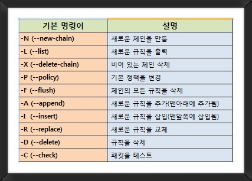

## Iptable


### 1. iptable 개념

iptables는 리눅스상에서 방화벽을 설정하는 도구로서 커널 2.4 이전 버전에서 사용되던 ipchains를 대신하는 방화벽 도구이다.

iptables는 커널상에서의 netfilter 패킷필터링 기능을 사용자 공간에서 제어하는 수준으로 사용할 수 있다.

**패킷필터링이란** 지나가는 패킷의 해더를 보고 그 전체 패킷의 운명을 결정하는 것을 말한다. 일반적으로 패킷은 해더와 데이터를 가진다. 해더에 필터링할 정보인 출발지IP:PORT, 도착지IP:PORT, checksum, 프로토콜 옵션등을 가지며 데이터는 각각의 전송데이터가 들어간다.

특정 조건을 가지고 있는 패킷에 대해 **허용(ACCEPT)**과 **차단(DROP)**등을 지정할 수 있으며, 특정 조건등을 통해 다양한 방식의 패킷 필터링과 처리 방식을 지원한다.

iptables 정책은 여러 구분으로 나눠지며 중요한 부분은 Chain이다. Chain은 패킷이 조작될 상태를 지정하며 iptables에 내장된 기본 Chain은 다음과 같다. (기본 Chain은 영구적이며 삭제가 불가능하다. 이외에 -N 옵션으로 지정하는 사용자 정의 Chain이 있다.)

- Chain INPUT : 서버로 들어오는 기본 정책
- Chain FORWARD : 서버에서 forwarding 기본 정책
- Chain OUTPUT : 서버에서 나가는 기본 정책
- Linux Server를 목적지로 삼는 모든 패킷은 **INPUT Chain**을 통과하고 Linux Server에서 생성되 외부로 보내지는 모든 패킷은 **OUTPUT Chain**을 통과하게 된다.**FORWARD Chain**의 경우 현재의 Linux Server가 목적지가 아닌 패킷이 통과하는 Chain이다. (FORWARD Chain은 NAT(네트워크 공유) 기능 사용을 위해 사용된다.)
  - 마스커레이드(Masquerade) : 내부 사설 IP의 PC들이 외부 인터넷이 연결 가능하도록 해주는 기능
  - NAT(Network Address Translation) : 네트워크 주소 변환 서비스
    - SNAT(Source NAT) **:** 내부 사설IP에서 외부로 나갈 때 공인IP로 변환 -> 마스커레이드와 비슷
    - DNAT(Destination NAT) : 외부에서 방화벽(외부IP)으로 요청되는 주소로 내부사설IP로 변환


### 2. iptable 구조

```
iptables -A INPUT -s [발신지] --sport [발신지 포트] -d [목적지] --dport [목적지 포트] -j [정책] 

1) 기본정책을 ACCEPT로 설정하는 법 :
 # iptables -P INPUT ACCEPT
 # iptables -P OUTPUT ACCEPT
 # iptables -P FORWARD ACCEPT

2) 현재 자신의 방화벽 규칙을 볼 수 있는 명령 :
 # iptables --list 또는 iptables -L

3) 규칙 추가 후에 저장하기 :
 # service iptables save 
  -> /etc/sysconfig/iptables 에 저장됨

4) 현재 iptables 규칙을 초기화 하기 :
 # iptables -F
```

#### NAT 구성 

```
# iptabls -L -v
# iptables -P INPUT ACCEPT
# iptables -P OUTPUT ACCEPT
# iptables -P FORWARD ACCEPT
# iptables -A INPUT -i lo -j ACCEPT
# iptables -t nat -A POSTROUTING -o eth0 -j MASQUERADE
# iptables -t nat -L
# echo 1 > /proc/sys/net/ipv4/ip_forward
```

```
# route add default gw <gateway주소>
# route del default gw <dateway주소>
# route add -net <네트워크 주소> netmask <서브넷 마스크> gw <Next Hop IP>
# route del -net [IP주소] netmask [서브넷 마스크]
```


#### 규칙 등록



* 먼저 Filter Table을 보려면 ` %iptabls -L -v`명령어를 이용하면 필터 테이블을 볼 수 있는데, 크게 Input,Forward,Output 체인으로 구성이 되어 있다. 
* 예를 들어 보면 
* `% sudo iptables -A INPUT -i lo -j ACCEPT` 는 모든 들어오는 트래픽에 대해서 Loopback interface는 모든 트래픽을 허용하도록 INPUT CHAIN을 설정한 것이다. 
* 만약 http,https,SSH 만 허용하려면 다음과 같이 사용하면 된다. 

```
% sudo iptables -A INPUT -p tcp --dport 22 -j ACCEPT
% sudo iptables -A INPUT -p tcp --dport 80 -j ACCEPT
% sudo iptables -A INPUT -p tcp --dport 443 -j ACCEPT
```

* 특정 IP에서 들어오는 트래픽을 허용하고자 하면 sudo iptables -A INPUT -s 192.168.1.3 -j ACCEPT게 설정하면 된다. 
* 반대로 특정 IP에서 들어오는 트래픽만 막고자 한다면 DROP을 하면 되는데, sudo iptables -A INPUT -s 192.168.1.3 -j DROP명령을 사용하면 된다. 
* 등록된 rule을 삭제하려면sudo iptables -L --line-numbers명령을 사용하면, 등록된 룰이 번호와 함께 나오고 sudo iptables -D INPUT 3명령으로 3번째 룰을 삭제할 수 있다

* iptables 명령어는 수정한 테이블과 룰은 메모리에만 남아 있기 때문에 재기동하면 삭제된다. 그래서 영구 반영하기 위해서는sudo /sbin/iptables-save명령으로 저장해야 한다. 


####  iptable 등록

```
1) 소스 ip가 192.168.0.111 인 접속의 모든 접속 포트를 막아라.
    # iptables -A INPUT -s 192.168.0.111 -j DROP

2) INPUT 사슬에 출발지 주소가 127.0.0.1(-s 127.0.0.1) 인 icmp 프로토콜(-p icmp) 패킷을 거부(-j DROP)하는 정책을 추가(-A)하라
    # iptables -A INPUT -p icmp -s 127.0.0.1 -j DROP

3) INPUT 사슬에 목적지 포트가 23번(--dport23)인 tcp 프로토콜(-p tcp) 패킷을 거부하는(-j DROP)규칙을 추가(-A) 하라.
    # iptables -A INPUT -p tcp --dport 23 -j DROP

4) INPUT 사슬에 목적지 포트 번호가 80번(--dport 80)인 tcp 프로토콜(-p tcp)패킷을 받아들이는(-j ACCEPT) 규칙을 추가(-A) 하라
    # iptables -A INPUT -p tcp --dport 80 -j ACCEPT

5) INPUT 사슬에 목적지 포트번호가 1023번 보다 작은 모든 포트(--dport :1023)인 tcp프로토콜(-p tcp)패킷을 거부하는(-j DROP)규칙을 추가(-A)하라
    # iptables -A INPUT -p tcp --dport :1023 -j DROP

6) ftp포트를 열어라
    # iptables -I INPUT -p tcp --dport 21 -j ACCEPT

7) imap 서비스를 방화벽에서 열어라
    # iptables -I INPUT -s 192.168.0.0/255.255.255.0 -p udp --dport 143 -j ACCEPT

8) 웹서버 방화벽 열어라
    # iptables -I INPUT -p tcp --dport 80 -j ACCEPT

9) 웹서버 포트 80 -> 8880으로 교체하라( 웹서비스 포트 변경시 /etc/services 에서도 변경 해줘야 함)
   # iptables -R INPUT 2 -p tcp --dport 8880 -j ACCEPT

10) domain-access_log 파일에 있는 모든 ip의 모든 접속 포트를 막아라(DOS공격 방어시 사용)
   # cat domain-access_log |awk '{print $1}'|sort |uniq |awk '{print "iptables -A INPUT -s "$1" -j DROP"}'|/bin/bash
```


### 3. NAT

#### NAT 의 종류

* SNAT(Source NAT) : Source IP 주소 변경 

* DNAT(Destination NAT): Destination IP 주소 변경
* **마스쿼레이딩 설정** ( SNAT 방식의 특이한 경우 ) : 마스커레이드(Masquerade) : 내부 사설 IP의 PC들이 외부 인터넷이 연결 가능하도록 해주는 기능


```
	        -i eth0                                   -o eth0
    PREROUTING -->  라우팅  ----------------->POSTROUTING----->
      (D-NAT)         |                         (S-NAT)
                      |                            ^
                      |                            |
                      +-------> 로컬 프로세스 -----+
```

#### SNAT

소스의 주소를 1.2.3.4로 변경하는 예

```# iptables -t nat -A POSTROUTING -o eth0 -j SNAT --to 1.2.3.4```

소스의 주소를 1.2.3.4 ~ 1.2.3.6 로 변경하는 예

```#iptables -t nat -A POSTROUTING -o eth0 -j SNAT --to 1.2.3.4-1.2.3.6```

소스의 주소를 1.2.3.4에 포트 1-1023으로 변경하는 예

```#iptables -t nat -A POSTROUTING -o eth0 -j SNAT --to 1.2.3.4:1-1023```


#### DNAT

목적지 주소를 1.2.3.4로 변경하는 경우

```# iptables -t nat -A PREROUTING -i eth1 -j DNAT --to 1.2.3.4```

목적지 주소를 1.2.3.4-1.2.3.6 로 변경하는 경우

```# iptables -t nat -A PREROUTING -i eth1 -j DNAT --to 1.2.3.4-1.2.3.6```

웹 트래픽에 대한 목적지 주소를 1.2.3.4의 8080 포트로 변경하는 경우

```# iptables -t nat -A PREROUTING -p tcp --dport 80 -i eth0 -j NAT --to 1.2.3.4:8080```

■ MASQERADE 설정 -> (예) firewall 서버에서 설정

```# iptables -t nat -A POSTROUTING -o eth0 -j MASQUERADE```

■ Network interface(eth0)을 통한 Port Forwarding

```# iptables -t nat -A PREROUTING -p tcp -i eth0 --dport ${port} -j DNAT --to ${IP:Port} ```

■ 특정 IP를 통한 Port Forwarding

```# iptables -t nat -A PREROUTING -p tcp -i eth0 -d ${IP} -j DNAT --to-destination ${IP:Port}```

■ Local Port Forwarding -> (예) sslstrip 

```# iptables -t nat -A PREROUTING -p tcp -d ${IP} --dport ${Port} -j REDIRECT --to-port ${Port}```


### 4. SNAT 이용한 NAT 구현

#### **마스쿼레이딩 설정** ( SNAT 방식의 특이한 경우 )

SNAT 는 외부로 통신할때 내부의 사설IP에서 공인 IP로 바꿔주는 역할을 한다.

스쿼레이딩은 IP를 지정하지 않고 외부로 나가는 NIC 카드를 지정하여 그때마다 지정된 NIC 카드의 IP를 부여한다.

```

# iptables -A INPUT -i lo -j ACCEPT
# iptables -t nat -A POSTROUTING -o eth0 -j MASQUERADE
# iptables -t nat -L
# echo 1 > /proc/sys/net/ipv4/ip_forward


```


### Reverse Proxy 설정

target <---(localHost Proxy 구성) <----Remote (70.X.X.X)

#### 1. local에서 터널링 구성 

로컬에서 터널링을 구성한다.   ssh로 접속할때 -R 옵션으로 포트를 지정한다.  

```
# ssh -R 1234:7.1.5.1:8080  root@70.X.X.X
```

#### 2. remote에서 1234 port 구성

* remote의 자신의 1234 포트를 접속하면 reverse로 접속된다. 

```
# export http_proxy=http://localhost:1234
# export https_proxy=http://localhost:1234
```

* 원격에서  1234 포트를 바라보게 proxy를 설정한다. 

#### 3. ngnix 설정

  /etc/nginx/nginx.conf

```
stream {
    server {
        listen 0.0.0.0:8888;
        proxy_pass 127.0.0.1:1234;
    }
}
```

* 서버가 그냥 한대 일때는 자기의 local  8888 을 바라보게 한다. 
* 브라우져에서  localhost: 8888를 proxy로 지정하면 된다. 

#### 4. sh일때는 

sh을 사용하는 경우는  export proxy 설정을 하면 된다.

#### 5. Local port proxy 

*    로컬포트 127.0.0.1:3306으로 접속하면 원격서버

```
Local Port Proxy
     ssh -L 3336:RemoteServer:3306 user@RemoteServer
```

#### 6.  Reverse Proxy

​    ssh -R 1111:7.1.5.1:8080  j@70.X.X.X
​    원격지의 1111 포트로 접속하면 local의 포토로 오는데 그것을 7.1.5.1:8080으로 포워딩하게 된다. 
