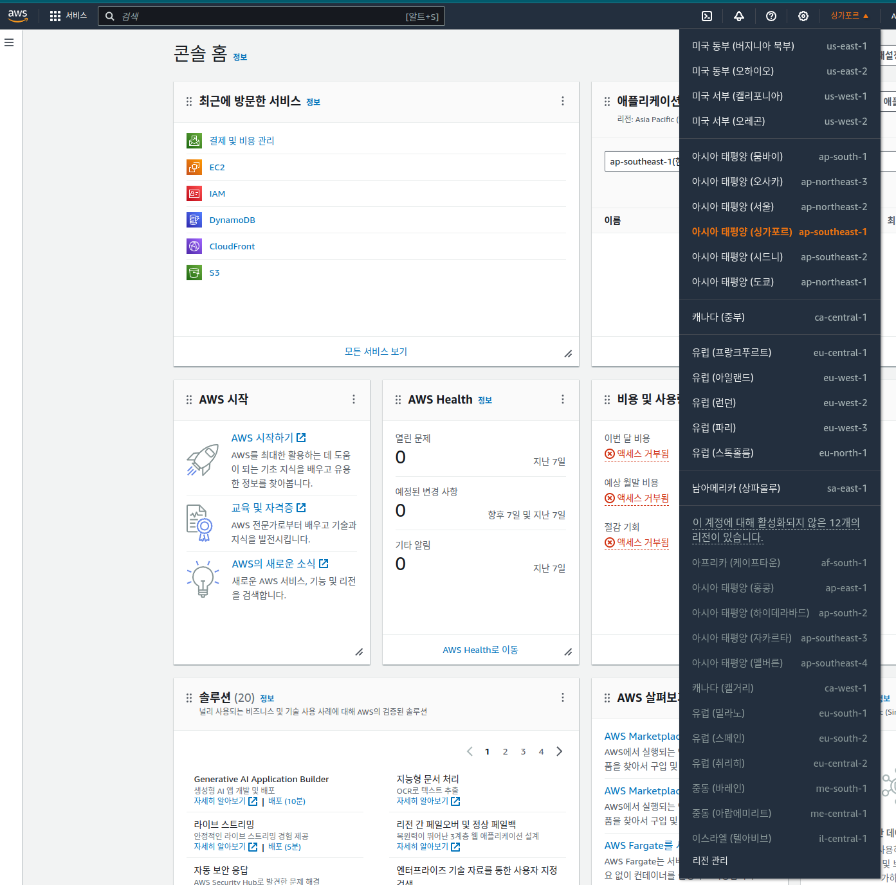

## 실습
Amazon Web Services(AWS) 환경은 리소스를 신속하고 저렴하게 사용할 수 있도록 설계된 하드웨어 및 소프트웨어 서비스의 통합된 모음입니다. AWS 환경에서 AWS API가 제공됩니다. API는 리소스와 통신하는 방법을 나타냅니다. 다양한 방법으로 AWS 리소스와 상호 작용할 수 있지만 모든 상호 작용에서는 AWS API가 사용됩니다. AWS 관리 콘솔은 간편한 AWS용 웹 인터페이스를 제공합니다. AWS Command Line Interface(AWS CLI)는 명령줄을 통해 AWS 서비스를 관리하는 통합 도구입니다. AWS 관리 콘솔을 통해 AWS에 액세스하는 경우와 명령줄 도구를 사용하는 경우 모두 AWS API를 호출하는 도구를 사용하게 됩니다.

이 실습은 아키텍팅 기본 사항 모듈의 내용을 토대로 진행됩니다. 해당 모듈에서는 AWS에서 워크로드를 생성하려면 충족해야 하는 핵심 요구 사항을 중점적으로 설명합니다. 이 실습에서는 해당 모듈의 내용, 즉 AWS 워크로드를 구축하는 도구, 방법, 위치를 더욱 명확하게 파악합니다. 먼저 AWS 관리 콘솔의 기능을 살펴본 후에, Amazon Simple Storage Service(Amazon S3) API를 사용해 두 가지 방법으로 Amazon S3 버킷을 배포하고 해당 버킷에 대한 연결을 테스트합니다.


## 과제 1: AWS 관리 콘솔 살펴보기 및 구성

### 과제 1.1: AWS 리전 선택




### 과제 1.2: AWS 관리 콘솔 검색


### 과제 1.3: 즐겨찾기 추가 및 제거


### 과제 1.4: 서비스용 콘솔 열기


---
## 과제 2: AWS 관리 콘솔을 사용하여 Amazon S3 버킷 생성


---
## 과제 3: S3 콘솔을 사용하여 Amazon S3 버킷에 객체 업로드


---
## 과제 4: AWS CLI를 사용하여 Amazon S3 버킷을 생성한 후 객체 업로드

### 과제 4.1: SESSION MANAGER를 사용하여 COMMAND HOST에 대한 연결 생성


* ec2-13-212-180-120.ap-southeast-1.compute.amazonaws.com


```sh
sh-5.2$ uname -a
Linux ip-10-1-11-43.ap-southeast-1.compute.internal 6.1.90-99.173.amzn2023.x86_64 #1 SMP PREEMPT_DYNAMIC Tue May  7 11:11:31 UTC 2024 x86_64 x86_64 x86_64 GNU/Linux
sh-5.2$
sh-5.2$ cat /etc/os-release
NAME="Amazon Linux"
VERSION="2023"
ID="amzn"
ID_LIKE="fedora"
VERSION_ID="2023"
PLATFORM_ID="platform:al2023"
PRETTY_NAME="Amazon Linux 2023.4.20240513"
ANSI_COLOR="0;33"
CPE_NAME="cpe:2.3:o:amazon:amazon_linux:2023"
HOME_URL="https://aws.amazon.com/linux/amazon-linux-2023/"
DOCUMENTATION_URL="https://docs.aws.amazon.com/linux/"
SUPPORT_URL="https://aws.amazon.com/premiumsupport/"
BUG_REPORT_URL="https://github.com/amazonlinux/amazon-linux-2023"
VENDOR_NAME="AWS"
VENDOR_URL="https://aws.amazon.com/"
SUPPORT_END="2028-03-15"
sh-5.2$
sh-5.2$
sh-5.2$ lsblk
NAME          MAJ:MIN RM SIZE RO TYPE MOUNTPOINTS
nvme0n1       259:0    0   8G  0 disk
├─nvme0n1p1   259:1    0   8G  0 part /
├─nvme0n1p127 259:2    0   1M  0 part
└─nvme0n1p128 259:3    0  10M  0 part /boot/efi
sh-5.2$
sh-5.2$
sh-5.2$ lscpu
Architecture:             x86_64
  CPU op-mode(s):         32-bit, 64-bit
  Address sizes:          46 bits physical, 48 bits virtual
  Byte Order:             Little Endian
CPU(s):                   2
  On-line CPU(s) list:    0,1
Vendor ID:                GenuineIntel
  Model name:             Intel(R) Xeon(R) Platinum 8259CL CPU @ 2.50GHz
    CPU family:           6
    Model:                85
    Thread(s) per core:   2
    Core(s) per socket:   1
    Socket(s):            1
    Stepping:             7
    BogoMIPS:             5000.00
    Flags:                fpu vme de pse tsc msr pae mce cx8 apic sep mtrr pge mca cmov pat pse36 clflush mmx fxsr sse sse2 ss ht syscall nx pdpe1gb rdtscp lm constant_tsc rep_good nopl xtopology nonsto
                          p_tsc cpuid tsc_known_freq pni pclmulqdq ssse3 fma cx16 pcid sse4_1 sse4_2 x2apic movbe popcnt tsc_deadline_timer aes xsave avx f16c rdrand hypervisor lahf_lm abm 3dnowprefetch
                           invpcid_single pti fsgsbase tsc_adjust bmi1 avx2 smep bmi2 erms invpcid mpx avx512f avx512dq rdseed adx smap clflushopt clwb avx512cd avx512bw avx512vl xsaveopt xsavec xgetbv1
                           xsaves ida arat pku ospke
Virtualization features:
  Hypervisor vendor:      KVM
  Virtualization type:    full
Caches (sum of all):
  L1d:                    32 KiB (1 instance)
  L1i:                    32 KiB (1 instance)
  L2:                     1 MiB (1 instance)
  L3:                     35.8 MiB (1 instance)
NUMA:
  NUMA node(s):           1
  NUMA node0 CPU(s):      0,1
Vulnerabilities:
  Gather data sampling:   Unknown: Dependent on hypervisor status
  Itlb multihit:          KVM: Mitigation: VMX unsupported
  L1tf:                   Mitigation; PTE Inversion
  Mds:                    Vulnerable: Clear CPU buffers attempted, no microcode; SMT Host state unknown
  Meltdown:               Mitigation; PTI
  Mmio stale data:        Vulnerable: Clear CPU buffers attempted, no microcode; SMT Host state unknown
  Reg file data sampling: Not affected
  Retbleed:               Vulnerable
  Spec rstack overflow:   Not affected
  Spec store bypass:      Vulnerable
  Spectre v1:             Mitigation; usercopy/swapgs barriers and __user pointer sanitization
  Spectre v2:             Mitigation; Retpolines; STIBP disabled; RSB filling; PBRSB-eIBRS Not affected; BHI Retpoline
  Srbds:                  Not affected
  Tsx async abort:        Not affected
sh-5.2$
sh-5.2$
sh-5.2$ lsmem
RANGE                                 SIZE  STATE REMOVABLE BLOCK
0x0000000000000000-0x000000003fffffff   1G online       yes   0-7

Memory block size:       128M
Total online memory:       1G
Total offline memory:      0B
sh-5.2$
```

```sh
sh-5.2$ ip a
1: lo: <LOOPBACK,UP,LOWER_UP> mtu 65536 qdisc noqueue state UNKNOWN group default qlen 1000
    link/loopback 00:00:00:00:00:00 brd 00:00:00:00:00:00
    inet 127.0.0.1/8 scope host lo
       valid_lft forever preferred_lft forever
    inet6 ::1/128 scope host noprefixroute
       valid_lft forever preferred_lft forever
2: ens5: <BROADCAST,MULTICAST,UP,LOWER_UP> mtu 9001 qdisc mq state UP group default qlen 1000
    link/ether 06:cf:a1:cf:89:97 brd ff:ff:ff:ff:ff:ff
    altname enp0s5
    altname eni-0f978a35f1a53a6f9
    altname device-number-0
    inet 10.1.11.43/24 metric 512 brd 10.1.11.255 scope global dynamic ens5
       valid_lft 2796sec preferred_lft 2796sec
    inet6 fe80::4cf:a1ff:fecf:8997/64 scope link
       valid_lft forever preferred_lft forever

sh-5.2$
sh-5.2$ ip route
default via 10.1.11.1 dev ens5 proto dhcp src 10.1.11.43 metric 512
10.1.0.2 via 10.1.11.1 dev ens5 proto dhcp src 10.1.11.43 metric 512
10.1.11.0/24 dev ens5 proto kernel scope link src 10.1.11.43 metric 512
10.1.11.1 dev ens5 proto dhcp scope link src 10.1.11.43 metric 512
sh-5.2$

sh-5.2$ ip link list
1: lo: <LOOPBACK,UP,LOWER_UP> mtu 65536 qdisc noqueue state UNKNOWN mode DEFAULT group default qlen 1000
    link/loopback 00:00:00:00:00:00 brd 00:00:00:00:00:00
2: ens5: <BROADCAST,MULTICAST,UP,LOWER_UP> mtu 9001 qdisc mq state UP mode DEFAULT group default qlen 1000
    link/ether 06:cf:a1:cf:89:97 brd ff:ff:ff:ff:ff:ff
    altname enp0s5
    altname eni-0f978a35f1a53a6f9
    altname device-number-0
```    

```sh
sh-5.2$ uptime
 09:58:15 up  7:16,  0 users,  load average: 0.00, 0.00, 0.00
sh-5.2$
sh-5.2$ date
Wed May 22 09:58:18 UTC 2024


sh-5.2$ env
PWD=/usr/bin
SYSTEMD_EXEC_PID=1598
HOME=/home/ssm-user
LANG=C.UTF-8
INVOCATION_ID=600153d3f83c4e638fe3151315b89d45
TERM=xterm-256color
SHLVL=1
JOURNAL_STREAM=8:16675
PATH=/usr/local/sbin:/usr/local/bin:/usr/sbin:/usr/bin
_=/usr/bin/env

sh-5.2$ id
uid=1001(ssm-user) gid=1001(ssm-user) groups=1001(ssm-user) context=system_u:system_r:unconfined_service_t:s0
sh-5.2$
```


```sh
sh-5.2$ systemctl | grep running
  boot-efi.automount               loaded active running   boot-efi.automount
  init.scope                       loaded active running   System and Service Manager
  acpid.service                    loaded active running   ACPI Event Daemon
  amazon-ssm-agent.service         loaded active running   amazon-ssm-agent
  atd.service                      loaded active running   Deferred execution scheduler
  auditd.service                   loaded active running   Security Auditing Service
  chronyd.service                  loaded active running   NTP client/server
  dbus-broker.service              loaded active running   D-Bus System Message Bus
  getty@tty1.service               loaded active running   Getty on tty1
  gssproxy.service                 loaded active running   GSSAPI Proxy Daemon
  irqbalance.service               loaded active running   irqbalance daemon
  libstoragemgmt.service           loaded active running   libstoragemgmt plug-in server daemon
  rngd.service                     loaded active running   Hardware RNG Entropy Gatherer Daemon
  serial-getty@ttyS0.service       loaded active running   Serial Getty on ttyS0
  sshd.service                     loaded active running   OpenSSH server daemon
  systemd-homed.service            loaded active running   Home Area Manager
  systemd-journald.service         loaded active running   Journal Service
  systemd-logind.service           loaded active running   User Login Management
  systemd-networkd.service         loaded active running   Network Configuration
  systemd-resolved.service         loaded active running   Network Name Resolution
  systemd-udevd.service            loaded active running   Rule-based Manager for Device Events and Files
  systemd-userdbd.service          loaded active running   User Database Manager
  acpid.socket                     loaded active running   ACPID Listen Socket
  dbus.socket                      loaded active running   D-Bus System Message Bus Socket
  systemd-journald-audit.socket    loaded active running   Journal Audit Socket
  systemd-journald-dev-log.socket  loaded active running   Journal Socket (/dev/log)
  systemd-journald.socket          loaded active running   Journal Socket
  systemd-networkd.socket          loaded active running   Network Service Netlink Socket
  systemd-udevd-control.socket     loaded active running   udev Control Socket
  systemd-udevd-kernel.socket      loaded active running   udev Kernel Socket
  systemd-userdbd.socket           loaded active running   User Database Manager Socket
  ```
### 과제 4.2: AWS CLI에서 고급 S3 명령 사용

```sh
sh-5.2$ which aws
/usr/local/bin/aws

sh-5.2$ aws s3 ls
2023-03-03 15:33:33 awslabs-resources-krxqqla59sui8d-us-east-1-737833037758
2023-10-23 17:54:19 awslabs-resources-r5b3y6ojjszcap-us-east-1-737833037758

sh-5.2$ aws s3 mb s3://labclibucket-700624
make_bucket: labclibucket-700624

sh-5.2$ aws s3 ls
2023-03-03 15:33:33 awslabs-resources-krxqqla59sui8d-us-east-1-737833037758
2023-10-23 17:54:19 awslabs-resources-r5b3y6ojjszcap-us-east-1-737833037758
2024-05-22 09:49:05 labbucket-700624
2024-05-22 10:01:43 labclibucket-700624

sh-5.2$ aws s3 cp /home/ssm-user/HappyFace.jpg s3://labclibucket-700624
upload: ../../home/ssm-user/HappyFace.jpg to s3://labclibucket-700624/HappyFace.jpg


sh-5.2$ aws s3 ls  labclibucket-700624
2024-05-22 10:02:56     131281 HappyFace.jpg
```


