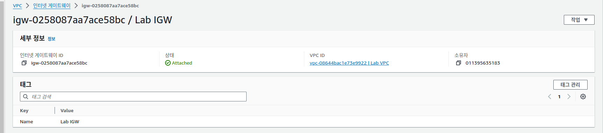
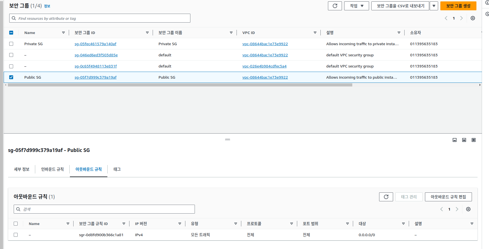

## 실습 개요

AWS 솔루션스 아키텍트는 Amazon Web Services(AWS)의 전반적 기능과 AWS 네트워킹 구성 요소 간의 관계를 이해해야 합니다. 이 실습에서는 Amazon Virtual Private Cloud(Amazon VPC), 단일 가용 영역의 퍼블릭 서브넷과 프라이빗 서브넷, 퍼블릭 및 프라이빗 경로, NAT 게이트웨이 및 인터넷 게이트웨이를 생성합니다. 이러한 서비스는 AWS 내부의 네트워킹 아키텍처의 기반입니다. 이 설계에는 인프라, 설계, 라우팅, 보안 개념이 포함됩니다.

다음 이미지에는 이 실습 환경의 최종 아키텍처를 보여 줍니다.


---
## 과제1: 특정리전에 VPC 생성 


### 1. VPC  생성 


### 2. VPC 설정 편집 
* DNS 호스트 이름 활성화
* DNS 확인 활성화


---
## 과제2: 퍼블릭 서브넷 및 프라이빗 서브넷 생성
이 과제에서는 Lab VPC에서 퍼블릭 서브넷과 프라이빗 서브넷을 생성합니다. VPC에 새 서브넷을 추가하려면 VPC의 범위에서 서브넷의 IPv4 CIDR 블록을 지정해야 합니다. 서브넷을 위치할 가용 영역을 지정할 수 있습니다. 동일한 가용 영역에 여러 서브넷을 위치할 수 있습니다.


### 1. public subnet 생성


### 2. private subnet 생성


* 라우팅 테이블


* 네트워크 ACL


---
## 과제3: internet gateway



---
## 과제4: public subnet traffic을 ineternet gateway로 라우팅


---
## 과제5: public 보안 그룹 생성
1. 인바운드 규칙

2. 아웃바운드 규칙


---
## 과제6 : EC2 인스턴스 생성


이 과제에서는 퍼블릭 서브넷에서 Amazon EC2 인스턴스를 시작합니다. 
* 인터넷을 통한 IPv4 통신을 활성화하려면 인스턴스에 해당 인스턴스의 프라이빗 IPv4 주소와 연결된 퍼블릭 IPv4 주소가 있어야 합니다. 
* 기본적으로 인스턴스는 VPC와 서브넷 안에서 정의된 프라이빗(내부) IP 주소 공간만 인식합니다


* 사용자 프로파일 
```sh
#!/bin/bash
# To connect to your EC2 instance and install the Apache web server with PHP
yum update -y
yum install -y httpd php8.1
systemctl enable httpd.service
systemctl start httpd
cd /var/www/html
wget https://us-west-2-tcprod.s3.amazonaws.com/courses/ILT-TF-200-ARCHIT/v7.7.3.prod-f959cb1c/lab-2-VPC/scripts/instanceData.zip
unzip instanceData.zip
```
---
## 과제7: http public instance에 접속
* http를 이용한 public dns를 이용한 외부 접속


```sh
sh-5.2$ ip a
1: lo: <LOOPBACK,UP,LOWER_UP> mtu 65536 qdisc noqueue state UNKNOWN group default qlen 1000
    link/loopback 00:00:00:00:00:00 brd 00:00:00:00:00:00
    inet 127.0.0.1/8 scope host lo
       valid_lft forever preferred_lft forever
    inet6 ::1/128 scope host noprefixroute
       valid_lft forever preferred_lft forever
2: ens5: <BROADCAST,MULTICAST,UP,LOWER_UP> mtu 9001 qdisc mq state UP group default qlen 1000
    link/ether 06:4e:6d:3e:3b:2d brd ff:ff:ff:ff:ff:ff
    altname enp0s5
    altname eni-0a49f1b188cd081c4
    altname device-number-0
    inet 10.0.0.16/24 metric 512 brd 10.0.0.255 scope global dynamic ens5
       valid_lft 2396sec preferred_lft 2396sec
    inet6 fe80::44e:6dff:fe3e:3b2d/64 scope link
       valid_lft forever preferred_lft forever

sh-5.2$ ip route
default via 10.0.0.1 dev ens5 proto dhcp src 10.0.0.16 metric 512
10.0.0.0/24 dev ens5 proto kernel scope link src 10.0.0.16 metric 512
10.0.0.1 dev ens5 proto dhcp scope link src 10.0.0.16 metric 512
10.0.0.2 dev ens5 proto dhcp scope link src 10.0.0.16 metric 512


sh-5.2$ lsblk
NAME          MAJ:MIN RM SIZE RO TYPE MOUNTPOINTS
nvme0n1       259:0    0   8G  0 disk
├─nvme0n1p1   259:1    0   8G  0 part /
├─nvme0n1p127 259:2    0   1M  0 part
└─nvme0n1p128 259:3    0  10M  0 part /boot/efi

sh-5.2$ df -h
Filesystem        Size  Used Avail Use% Mounted on
devtmpfs          4.0M     0  4.0M   0% /dev
tmpfs             453M     0  453M   0% /dev/shm
tmpfs             182M  424K  181M   1% /run
/dev/nvme0n1p1    8.0G  1.6G  6.4G  20% /
tmpfs             453M     0  453M   0% /tmp
/dev/nvme0n1p128   10M  1.3M  8.7M  13% /boot/efi
```
---
## 과제8: session manager 접속
* session manager 이용한 접속


EC2 인스턴스 연결을 사용하여 인스턴스에 연결하는 데 필요한 IAM 권한을 확인할 수 없음
EC2 인스턴스 연결을 통해 인스턴스에 연결하려면 다음 권한을 부여하는 연결된 IAM 정책이 있어야 합니다.
* ec2-instance-connect:SendSSHPublicKey
* ec2:DescribeInstances

---
## 과제9: NAT 구성한 private 접속


* 라우팅 테이블 등록


* private subnet 연결 


---
## 과제 10: 프라이빗 리소스용 보안 그룹 생성
* 보안그룹은 VPC 보안정책을 적용한다. 이것을 꼭 방화벽이라고 하기는 그렇고 VPC안에서 설정된 보안 정책이라고 보면 될 것 같다. 그리고  이렇게 설정된 보안 정책을 EC2에 적용하는 것이라고  보면 되겠다. 그런데 이것이 실제로 EC2에서 ufw 처럼 시스템 도구로 등록되는 것은 아니다. VPC안에서 동작하고 관리하는 보안 정책이다.  


---
## 과제 11: 프라이빗 서브넷에서 Amazon EC2 인스턴스 시작


* 보안 그룹


* 네트워크 


* 스토리지


---
## 과제 12: 프라이빗 서브넷의 Amazon EC2 인스턴스에 연결

```sh
sh-5.2$ cd ~
curl -I https://aws.amazon.com/training/
HTTP/2 200
content-type: text/html;charset=UTF-8
server: Server
date: Wed, 22 May 2024 10:40:43 GMT
x-amz-rid: HATBPMY2JSWPH1DV0GEB
set-cookie: aws-priv=eyJ2IjoxLCJldSI6MCwic3QiOjB9; Version=1; Comment="Anonymous cookie for privacy regulations"; Domain=.aws.amazon.com; Max-Age=31536000; Expires=Thu, 22 May 2025 10:40:43 GMT; Path=/; Secure
set-cookie: aws_lang=en; Domain=.amazon.com; Path=/
x-frame-options: SAMEORIGIN
x-xss-protection: 1; mode=block
strict-transport-security: max-age=63072000
x-amz-id-1: HATBPMY2JSWPH1DV0GEB
last-modified: Tue, 21 May 2024 23:22:00 GMT
x-content-type-options: nosniff
vary: accept-encoding,Content-Type,Accept-Encoding,User-Agent
x-cache: Miss from cloudfront
via: 1.1 ec75fb3eaaf9729edc3317dd95f42eea.cloudfront.net (CloudFront)
x-amz-cf-pop: NRT57-P1
x-amz-cf-id: rzmR8TxReekO1N_9N9wdBCd06iEugIXDSsDjgbtVEaW-F2LxFgBWgA==
```


```sh
sh-5.2$ ip a
1: lo: <LOOPBACK,UP,LOWER_UP> mtu 65536 qdisc noqueue state UNKNOWN group default qlen 1000
    link/loopback 00:00:00:00:00:00 brd 00:00:00:00:00:00
    inet 127.0.0.1/8 scope host lo
       valid_lft forever preferred_lft forever
    inet6 ::1/128 scope host noprefixroute
       valid_lft forever preferred_lft forever
2: ens5: <BROADCAST,MULTICAST,UP,LOWER_UP> mtu 9001 qdisc mq state UP group default qlen 1000
    link/ether 06:7c:cc:f1:e6:fd brd ff:ff:ff:ff:ff:ff
    altname enp0s5
    altname eni-082061cab5f7cbde8
    altname device-number-0
    inet 10.0.3.18/23 metric 512 brd 10.0.3.255 scope global dynamic ens5
       valid_lft 3516sec preferred_lft 3516sec
    inet6 fe80::47c:ccff:fef1:e6fd/64 scope link
       valid_lft forever preferred_lft forever
sh-5.2$
sh-5.2$
sh-5.2$ ip a
1: lo: <LOOPBACK,UP,LOWER_UP> mtu 65536 qdisc noqueue state UNKNOWN group default qlen 1000
    link/loopback 00:00:00:00:00:00 brd 00:00:00:00:00:00
    inet 127.0.0.1/8 scope host lo
       valid_lft forever preferred_lft forever
    inet6 ::1/128 scope host noprefixroute
       valid_lft forever preferred_lft forever
2: ens5: <BROADCAST,MULTICAST,UP,LOWER_UP> mtu 9001 qdisc mq state UP group default qlen 1000
    link/ether 06:7c:cc:f1:e6:fd brd ff:ff:ff:ff:ff:ff
    altname enp0s5
    altname eni-082061cab5f7cbde8
    altname device-number-0
    inet 10.0.3.18/23 metric 512 brd 10.0.3.255 scope global dynamic ens5
       valid_lft 3359sec preferred_lft 3359sec
    inet6 fe80::47c:ccff:fef1:e6fd/64 scope link
       valid_lft forever preferred_lft forever
sh-5.2$
sh-5.2$ ip route
default via 10.0.2.1 dev ens5 proto dhcp src 10.0.3.18 metric 512
10.0.0.2 via 10.0.2.1 dev ens5 proto dhcp src 10.0.3.18 metric 512
10.0.2.0/23 dev ens5 proto kernel scope link src 10.0.3.18 metric 512
10.0.2.1 dev ens5 proto dhcp scope link src 10.0.3.18 metric 512
sh-5.2$
sh-5.2$
sh-5.2$ lsblk
NAME          MAJ:MIN RM SIZE RO TYPE MOUNTPOINTS
nvme0n1       259:0    0   8G  0 disk
├─nvme0n1p1   259:1    0   8G  0 part /
├─nvme0n1p127 259:2    0   1M  0 part
└─nvme0n1p128 259:3    0  10M  0 part /boot/efi
sh-5.2$
sh-5.2$
sh-5.2$ df -h
Filesystem        Size  Used Avail Use% Mounted on
devtmpfs          4.0M     0  4.0M   0% /dev
tmpfs             453M     0  453M   0% /dev/shm
tmpfs             182M  424K  181M   1% /run
/dev/nvme0n1p1    8.0G  1.6G  6.4G  20% /
tmpfs             453M     0  453M   0% /tmp
/dev/nvme0n1p128   10M  1.3M  8.7M  13% /boot/efi
sh-5.2$
sh-5.2$
sh-5.2$ uname -a
Linux ip-10-0-3-18.ap-northeast-1.compute.internal 6.1.90-99.173.amzn2023.x86_64 #1 SMP PREEMPT_DYNAMIC Tue May  7 11:11:31 UTC 2024 x86_64 x86_64 x86_64 GNU/Linux
```

## 선택 과제  

* private instance IP 10.0.3.18
* public  instance IP 10.0.0.16

1. ping fail
```sh
sh-5.2$ ping 10.0.3.18
PING 10.0.3.18 (10.0.3.18) 56(84) bytes of data.
```


* 보안그룹에 inbound 규칙을 추가한다.  


