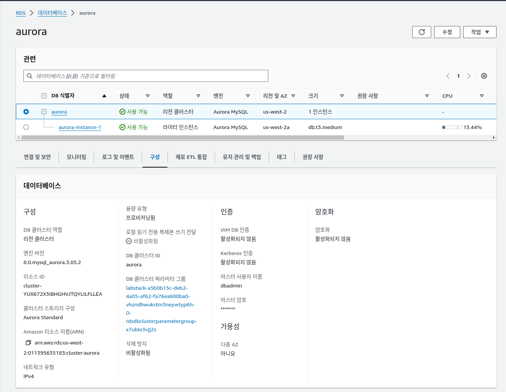

## 개요

팀이 새로운 웹 기반 애플리케이션의 아키텍처 프로토타입 생성 업무를 맡았습니다. 아키텍처를 정의하려면 로드 밸런서와 Amazon RDS 같은 관리형 데이터베이스를 더욱 자세히 파악해야 합니다.

실습 환경
실습을 시작할 수 있도록 실습 환경에서 제공되는 리소스는 Amazon Virtual Private Cloud(Amazon VPC), 필요한 기본 네트워크 구조, 인바운드 및 아웃바운드 트래픽 제어용 보안 그룹 3개, 프라이빗 서브넷의 EC2 인스턴스 2개, 관련 EC2 인스턴스 프로파일 1개입니다. 인스턴스 프로파일에는 AWS Systems Manager Session Manager 기능이 EC2 인스턴스에 액세스하도록 허용하는 데 필요한 권한이 포함되어 있습니다.

---
## 과제 1: Amazon RDS 데이터베이스 생성

---
## 과제 2: Application Load Balancer 생성 및 구성

이 과제에서는 퍼블릭 서브넷에 Application Load Balancer를 생성하여 브라우저에서 애플리케이션에 액세스합니다. Amazon EC2 콘솔로 이동하여 기존 Amazon VPC 인프라에 Application Load Balancer를 생성하고 프라이빗 EC2 인스턴스를 대상으로 추가합니다.

로드 밸런서는 클라이언트에 대한 단일 접점 역할을 수행합니다. 클라이언트는 로드 밸런서에 요청을 전송하고, 로드 밸런서는 EC2 인스턴스와 같은 대상에 요청을 전송합니다. 로드 밸런서를 구성하려면 대상 그룹을 생성한 다음 대상 그룹에 대상을 등록합니다.

### 과제 2.1: 대상 그룹 생성

### 과제 2.2: APPLICATION LOAD BALANCER 생성

 이 과제에서는 Application Load Balancer를 생성하고 EC2 인스턴스를 로드 밸런서에 대상으로 추가했습니다. 이 과제에서는 대상을 로드 밸런서에 등록하는 방법을 보여줍니다. 개별 EC2 인스턴스 외에 Auto Scaling 그룹도 로드 밸런서의 대상으로 등록할 수 있습니다. Auto Scaling 그룹을 로드 밸런싱의 대상으로 사용하는 경우 Auto Scaling 그룹이 시작하는 인스턴스는 로드 밸런서에 자동으로 등록됩니다. 마찬가지로 Auto Scaling 그룹이 종료하는 EC2 인스턴스는 로드 밸런서에서 자동으로 등록 취소됩니다. 로드 밸런서와 함께 Auto Scaling 그룹을 사용하는 방법은 다음 실습에서 설명합니다.

---
## 과제 3: 콘솔을 통해 Amazon RDS DB 인스턴스 메타데이터 검토

* aurora.cluster-cudowr9hmk4j.us-west-2.rds.amazonaws.com

 경고: 다음 과제를 계속 진행하기 전에 aurora DB instance의 Status가  Available로 표시될 때까지 기다리십시오.

---
## 과제 4: 애플리케이션의 데이터베이스 연결 테스트

이 과제에서는 Application Load Balancer URL을 확인한 후 로드 밸런서를 통해 기본적인 HTTP 요청을 실행합니다. 그리고 EC2 인스턴스에 설치된 웹 애플리케이션을 시작하여 애플리케이션의 데이터베이스 연결을 테스트합니다.

 추가 정보: Elastic Load Balancing은 웹 서비스 인스턴스의 ping 경로를 주기적으로 테스트하여 상태를 확인합니다. 200 HTTP 응답 코드는 정상 상태를 나타내고, 그 밖의 응답 코드는 비정상 상태를 나타냅니다. 인스턴스가 비정상이고 일정 횟수의 연속 검사(비정상 임계값)에서 해당 상태가 지속되는 경우 로드 밸런서는 복구될 때까지 해당 인스턴스를 서비스에서 제거합니다. 자세한 내용은, 다음을 참조하십시오. 대상 그룹에 대한 상태 확인

