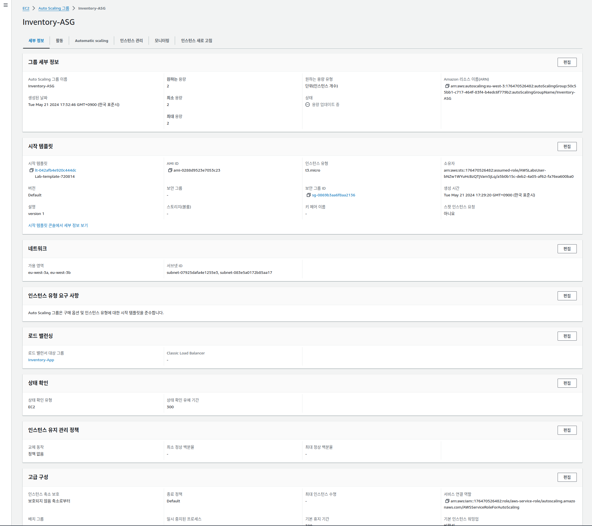
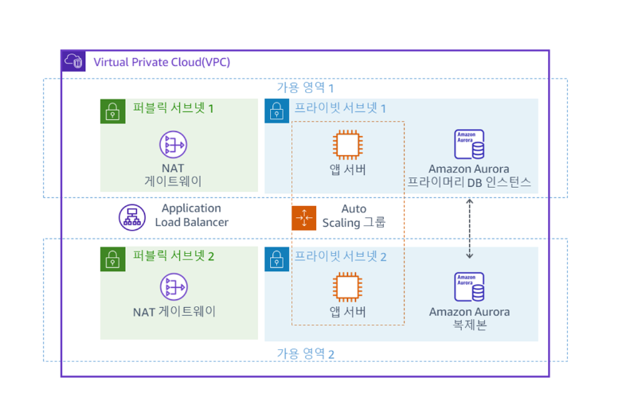

# 실습 4: Amazon VPC에서 고가용성 구성

Amazon Web Services(AWS)는 클라우드에서 안정적이고 내결함성이 있으며 가용성이 뛰어난 시스템을 구축하기 위한 서비스와 인프라를 제공합니다. 내결함성은 시스템을 구축하는 데 사용되는 일부 구성 요소에 장애가 발생해도 계속 작동할 수 있는 시스템의 능력입니다. 고가용성은 시스템 장애를 예방하는 것이 아니라 장애에서 빠르게 복구하는 시스템의 능력입니다. AWS 솔루션스 아키텍트는 가용성이 뛰어나고 필요할 경우 내결함성을 갖춘 시스템을 설계하고 이러한 설계의 이점과 비용을 이해해야 합니다. 이 실습에서는 두 가지 유용한 AWS 서비스인 Elastic Load Balancing과 Auto Scaling 그룹을 통합합니다. 애플리케이션 서버로 작동하는 Amazon Elastic Compute Cloud(Amazon EC2) 인스턴스의 Auto Scaling 그룹을 생성한 다음, Auto Scaling 그룹 내 인스턴스 간에 부하가 균형있게 전달되도록 Application Load Balancer를 구성합니다. 계속해서 다중 AZ를 허용하고 읽기 전용 복제본을 생성한 후 승격하는 등 Amazon Relational Database Service(Amazon RDS)를 사용해 봅니다. 읽기 전용 복제본을 사용할 경우 데이터를 프라이머리 데이터베이스에 쓰고 읽기 전용 복제본에서 읽을 수 있습니다. 읽기 전용 복제본은 프라이머리 데이터베이스로 승격할 수 있으므로 고가용성과 재해 복구에 유용한 도구입니다.


---
## 과제 1: 기존 실습 환경 검사
### 과제 1.1: 네트워크 인프라 검사

#### 1.VPC

* VPC 생성


* subnet


* 라우팅 테이블


* 네트워크 ACL


* 인터넷 게이트웨이


* 보안그룹
1. inbound

1. outbound


* DB 보안 그룹


### 과제 1.2: EC2 인스턴스 검사

#### AppServer 인스턴스


#### 사용자 데이터 편집


```sh

#!/bin/bash
#yum -y update
dnf update -y
dnf install -y httpd wget php-fpm php-mysqli php-json php php-devel

# Install and enable AWS Systems Manager Agent
cd /tmp
systemctl enable amazon-ssm-agent
systemctl start amazon-ssm-agent

# Download Inventory App Lab files
wget https://eu-west-1-tcprod.s3.eu-west-1.amazonaws.com/courses/ILT-TF-200-ARCHIT/v7.7.3.prod-f959cb1c/lab-4-HA/scripts/inventory-app.zip
unzip inventory-app.zip -d /var/www/html/

# Download and install the AWS SDK for PHP
wget https://github.com/aws/aws-sdk-php/releases/download/3.295.2/aws.zip
unzip aws -d /var/www/html
unzip /var/www/html/aws.zip -d /var/www/html/

# Load Amazon Aurora DB connection details from AWS CloudFormation
un="dbadmin"
pw="lab-password"
ep="inventory-cluster.cluster-cbfpgyqzulrz.eu-west-1.rds.amazonaws.com"
db="inventory"

# Populate PHP app settings with DB info
sed -i "s/DBENDPOINT/$ep/g" /var/www/html/get-parameters.php
sed -i "s/DBNAME/$db/g" /var/www/html/get-parameters.php
sed -i "s/DBUSERNAME/$un/g" /var/www/html/get-parameters.php
sed -i "s/DBPASSWORD/$pw/g" /var/www/html/get-parameters.php

# Turn on web server
systemctl start httpd.service
systemctl enable httpd.service


```


### 과제 1.3: 로드 밸런서 구성 검사

####  Target group


#### LB 검사 


### 과제 1.4: 웹 브라우저에서 PHP 재고 애플리케이션 열기


설정을 저장하면 재고 애플리케이션이 기본 페이지로 리디렉션되고, 다양한 항목의 재고가 표시됩니다. 재고에 항목을 추가하거나 기존 재고 항목의 세부 정보를 수정해도 됩니다. 이 애플리케이션과 상호 작용할 때 로드 밸런서는 로드 밸런서의 대상 그룹에서 이전에 본 AppServer로 요청을 전달합니다. AppServer는 Aurora 데이터베이스의 재고 변경 사항을 기록합니다. 웹 페이지 하단에는 인스턴스 ID와 인스턴스가 있는 가용 영역이 표시됩니다.

 참고: 나머지 실습 과제를 수행하는 동안 이 재고 애플리케이션 웹 브라우저 탭을 열어 두십시오. 이후 과제에서 이 탭으로 다시 돌아옵니다.


---
## 과제 2: 시작 템플릿 생성
### 인스턴스 템플릿 생성

### 템플릿 생성


---
## 과제 3: Auto Scaling 그룹 생성


이 과제에서는 프라이빗 서브넷에 EC2 인스턴스를 배포하는 Auto Scaling 그룹을 생성합니다. 프라이빗 서브넷의 인스턴스는 인터넷에서 액세스할 수 없기 때문에 애플리케이션을 배포할 때는 이것이 보안 모범 사례입니다. 대신 사용자가 Application Load Balancer에 요청을 보내면 다음 다이어그램과 같이 해당 요청이 프라이빗 서브넷에 있는 EC2 인스턴스에 전달됩니다.





## 과제 4: 애플리케이션 테스트

1. target group  확인 

Registered targets 섹션에 3개의 인스턴스가 있습니다. 여기에는 이름이 Inventory-App인 Auto Scaling 인스턴스 2개와 과제 1에서 검사한 AppServer라는 원래 인스턴스가 포함됩니다. Health Status 열에는 인스턴스에 대해 수행한 로드 밸런서 상태 확인 결과가 표시됩니다. 이 과제에서는 대상 그룹에서 원래 AppServer 인스턴스를 제거하고 Amazon EC2 Auto Scaling이 관리하는 2개의 인스턴스만 남깁니다.
2. 등록 취소 


인스턴스가 등록 취소되는 즉시 로드 밸런서는 대상으로의 요청 라우팅을 중지합니다. AppServer 인스턴스의 Health status 열에는 draining 상태가 표시되고, Health Status Details 열에는 진행 중인 요청이 완료될 때까지 Target deregistration is in progress가 표시됩니다. 몇 분이 지나면 AppServer 인스턴스 등록 취소가 완료되고, 등록된 대상 목록에는 2개의 Auto Scaling 인스턴스만 남습니다.

 참고: 인스턴스 등록을 취소하면 로드 밸런서에서 인스턴스가 분리될 뿐입니다. AppServer 인스턴스는 사용자가 종료할 때까지 계속 무기한 실행됩니다.

 


### ELB에서 health check 
* EC2 autoScale 에서도 health check : 2by2 (elb)
* ELB에서도 health check  : Application 상태


### ELB vs EC2 Auto Acaling 


* application은 문제가 있고
* EC2 시스템은 정상 상황 
=> launch template를 수정해서 V1, V2, V3  에서 V2를 가르키도록 수정 


### ELB와 ASG 결합한 상황


---
## 과제 5: 애플리케이션 티어의 고가용성 테스트


---
### 과제 6: 데이터베이스 티어의 고가용성 구성
이전 과제에서 애플리케이션 티어의 고가용성을 확인했습니다. 하지만 Aurora 데이터베이스는 여전히 하나의 데이터베이스 인스턴스에서만 작동하고 있습니다.

### 과제 6.1: 여러 가용 영역에서 실행되도록 데이터베이스 구성


 추가 정보: Aurora 복제본 시작이 완료되면 데이터베이스가 여러 가용 영역에 고가용성 구성으로 배포됩니다. 이는 데이터베이스가 여러 인스턴스에 분산 된다는 뜻은 아닙니다. 프라이머리 DB 인스턴스와 Aurora 복제본 모두 동일한 공유 스토리지에 액세스하지만 프라이머리 DB 인스턴스만 쓰기에 사용할 수 있습니다. Aurora 복제본의 주 용도는 두 가지입니다. Aurora 복제본에 쿼리를 실행하여 애플리케이션에 대한 읽기 작업 크기를 조정할 수 있습니다. 그러려면 일반적으로 클러스터의 Reader 엔드포인트에 연결합니다. 이렇게 하면 Aurora가 읽기 전용 연결의 부하를 클러스터에 있는 여러 Aurora 복제본에 분산시킬 수 있습니다. Aurora 복제본은 가용성을 높이는 데도 도움이 됩니다. 클러스터의 쓰기 인스턴스를 사용할 수 없게 되면 Aurora는 자동으로 읽기 인스턴스 중 하나를 새 쓰기 인스턴스로 승격합니다. 자세한 내용은, 다음을 참조하십시오. Amazon Aurora를 사용한 복제


---
## 과제 7: NAT 게이트웨이가 고가용성을 제공하도록 설정

이 과제에서는 두 번째 가용 영역에 있는 또 다른 NAT 게이트웨이를 시작하여 NAT 게이트웨이를 고가용성으로 만듭니다.

2개의 가용 영역에 걸친 프라이빗 서브넷에 Inventory-App 서버가 배포되어 있습니다. 인터넷에 액세스해야 하는 경우(예: 데이터 다운로드) 요청은 퍼블릭 서브넷에 있는 NAT 게이트웨이를 통해 리디렉션되어야 합니다. 현재 아키텍처에는 Public Subnet 1에 NAT 게이트웨이 하나만 있고, 모든 Inventory-App 서버가 이 NAT 게이트웨이를 사용하여 인터넷에 연결합니다. 즉, 가용 영역 1에서 장애가 발생하면 어느 애플리케이션 서버도 인터넷과 통신할 수 없습니다. 가용 영역 2에 두 번째 NAT 게이트웨이를 추가하면 가용 영역 1에 장애가 발생하더라도 프라이빗 서브넷의 리소스가 인터넷에 연결할 수 있습니다.





### 과제 7.1: 두 번째 NAT 게이트웨이 생성


### 과제 7.2: 새 라우팅 테이블 생성 및 구성


### 과제 7.3: 프라이빗 서브넷 2의 라우팅 구성


---
## 과제 8: Aurora 데이터베이스 장애 조치 적용


 축하합니다! 다음 작업을 완료했습니다.

Amazon EC2 Auto Scaling 그룹을 생성하여 여러 가용 영역을 포함하는 Application Load Balancer에 등록
고가용성 Aurora DB 클러스터 생성
고가용성을 제공하도록 Aurora DB 클러스터 수정
중복 NAT 게이트웨이를 사용하여 고가용성을 갖추도록 Amazon VPC 구성 수정
읽기 전용 복제본 인스턴스에 대한 장애 조치를 수행하는 데이터베이스 기능 확인
