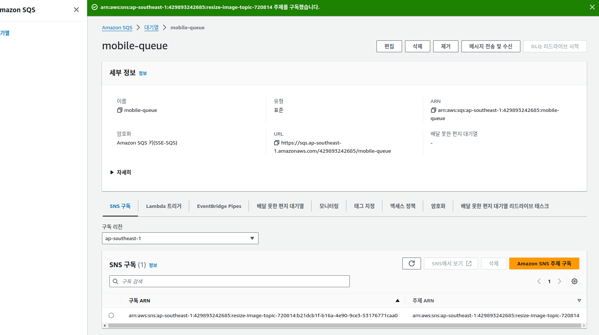
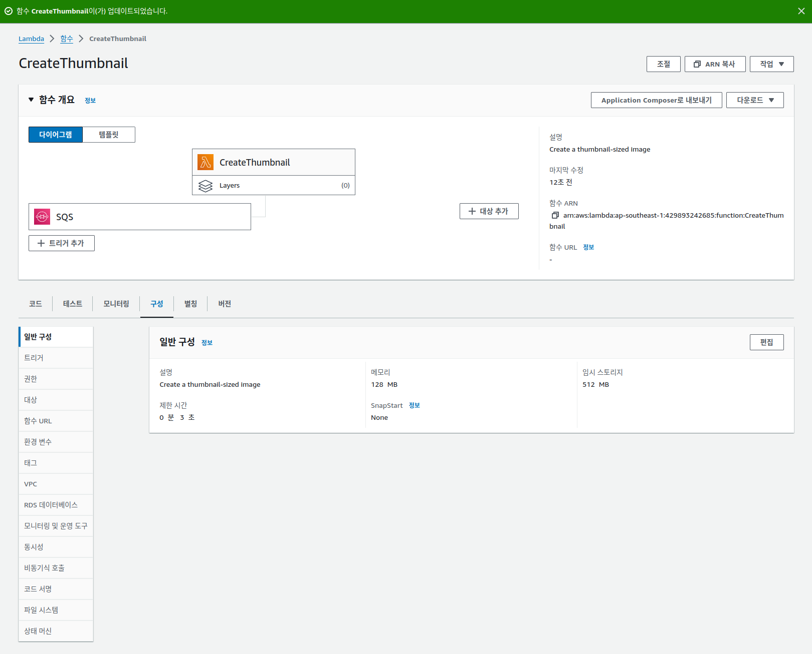

---
## 과제1. 주제생성


주제 ARN 및 Topic owner 값을 메모장에 복사합니다. 이 값은 실습 뒷부분에서 필요합니다


* ARN: arn:aws:sns:ap-southeast-1:429893242685:resize-image-topic-720814

* 주제 소유자: 429893242685


---
## 과제2. 대기열 생성
### 과제 2.1: 썸네일 이미지용 AMAZON SQS 대기열 생성


### 과제 2.2: 모바일 이미지용 AMAZON SQS 대기열 생성



### 과제 2.3: AWS SNS 구독 확인


---
## 과제 3: Amazon S3 이벤트 알림 생성
### 과제 3.1: AMAZON S3 버킷이 주제에 게시를 할 수 있도록 AMAZON SNS 액세스 정책 구성


```json
{
  "Version": "2008-10-17",
  "Id": "__default_policy_ID",
  "Statement": [
    {
      "Sid": "__default_statement_ID",
      "Effect": "Allow",
      "Principal": {
        "AWS": "*"
      },
      "Action": [
        "SNS:GetTopicAttributes",
        "SNS:SetTopicAttributes",
        "SNS:AddPermission",
        "SNS:RemovePermission",
        "SNS:DeleteTopic",
        "SNS:Subscribe",
        "SNS:ListSubscriptionsByTopic",
        "SNS:Publish"
      ],
      "Resource": "SNS_TOPIC_ARN",
      "Condition": {
        "StringEquals": {
          "AWS:SourceAccount": "SNS_TOPIC_OWNER"
        }
      }
    },
    {
      "Effect": "Allow",
      "Principal": {
        "Service": "s3.amazonaws.com"
      },
      "Action": "SNS:Publish",
      "Resource": "SNS_TOPIC_ARN",
      "Condition": {
        "StringEquals": {
          "AWS:SourceAccount": "SNS_TOPIC_OWNER"
        }
      }
    }
  ]
}
```


### 과제 3.2: 수집 S3 버킷에 업로드 시 단일 S3 이벤트 알림 생성


---
## 과제 4: AWS Lambda 함수 2개 생성 및 구성

### 과제 4.1: 썸네일 이미지를 생성하는 LAMBDA 함수 생성


### 과제 4.2: SQS 트리거를 추가하고 PYTHON 배포 패키지를 업로드하도록 CREATETHUMBNAIL LAMBDA 함수 구성


```python
import boto3
import os
import sys
import uuid
from urllib.parse import unquote_plus
from PIL import Image
import PIL.Image
import json

s3_client = boto3.client("s3")
s3 = boto3.resource("s3")


def resize_image(image_path, resized_path):
    with Image.open(image_path) as image:
        image.thumbnail((128, 128))
        image.save(resized_path)


def handler(event, context):
    for record in event["Records"]:
        payload = record["body"]
        sqs_message = json.loads(payload)
        bucket_name = json.loads(sqs_message["Message"])["Records"][0]["s3"]["bucket"][
            "name"
        ]
        print(bucket_name)
        key = json.loads(sqs_message["Message"])["Records"][0]["s3"]["object"]["key"]
        print(key)

        download_path = "/tmp/{}{}".format(uuid.uuid4(), key.split("/")[-1])
        upload_path = "/tmp/resized-{}".format(key.split("/")[-1])

        s3_client.download_file(bucket_name, key, download_path)
        resize_image(download_path, upload_path)
        s3.meta.client.upload_file(
            upload_path, bucket_name, "thumbnail/Thumbnail-" + key.split("/")[-1]
        )
```




### 과제 4.4: SQS 트리거를 추가하고 PYTHON 배포 패키지를 업로드하도록 CREATEMOBILEIMAGE LAMBDA 함수 구성


```python
import boto3
import os
import sys
import uuid
from urllib.parse import unquote_plus
from PIL import Image
import PIL.Image
import json

s3_client = boto3.client("s3")
s3 = boto3.resource("s3")


def resize_image(image_path, resized_path):
    with Image.open(image_path) as image:
        image.thumbnail((640, 320))
        image.save(resized_path)


def handler(event, context):
    for record in event["Records"]:
        payload = record["body"]
        sqs_message = json.loads(payload)
        bucket_name = json.loads(sqs_message["Message"])["Records"][0]["s3"]["bucket"][
            "name"
        ]
        print(bucket_name)
        key = json.loads(sqs_message["Message"])["Records"][0]["s3"]["object"]["key"]
        print(key)

        download_path = "/tmp/{}{}".format(uuid.uuid4(), key.split("/")[-1])
        upload_path = "/tmp/resized-{}".format(key.split("/")[-1])

        s3_client.download_file(bucket_name, key, download_path)
        resize_image(download_path, upload_path)
        s3.meta.client.upload_file(
            upload_path, bucket_name, "mobile/MobileImage-" + key.split("/")[-1]
        )

```

---
## 과제 5: Amazon S3 버킷에 객체 업로드


---
## 과제 6: 처리된 파일 확인


