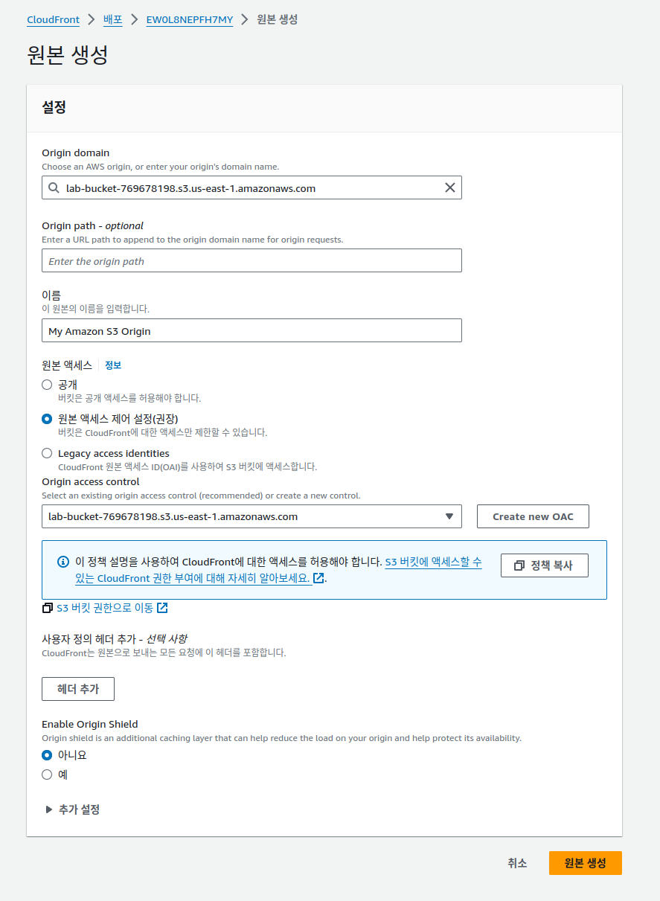

---
## 과제 1: 기존 CloudFront 배포 살펴보기

### 과제 1.1: CLOUDFRONT 콘솔 열기


* arn:aws:cloudfront::242259930807:distribution/EW0L8NEPFH7MY
* https://d3plmh6g0y9gj2.cloudfront.net


* LabELB-1358111015.us-east-1.elb.amazonaws.com


---
## 과제 2: S3 버킷 생성


---
## 과제 3: 퍼블릭 액세스가 가능하도록 S3 LabBucket 구성
### 과제 3.1: 퍼블릭 정책을 생성할 수 있도록 LABBUCKET 구성


### 과제 3.2: LABBUCKET의 퍼블릭 읽기 정책 구성
* arn:aws:s3:::lab-bucket-769678198
* arn:aws:s3:::lab-bucket-769678198


---
## 과제 4: 버킷에 객체를 업로드하고 퍼블릭 액세스 테스트
### 과제 4.1: 버킷에 새 폴더 생성


### 과제 4.2: 버킷에 객체 업로드


### 과제 4.3: 객체에 대한 퍼블릭 액세스 테스트

* https://lab-bucket-769678198.s3.amazonaws.com/CachedObjects/logo.png


---
## 과제 5: Amazon CloudFront 및 오리진 액세스 제어로 버킷 보호
### 과제 5.1: LABBUCKET 버킷 정책 업데이트


### 과제 5.2: 퍼블릭 액세스 차단기 사용


### 과제 5.3: 오리진 액세스 제어(OAC)로 새 오리진 생성





### 과제 5.4: AMAZON S3 오리진의 새 동작 생성


---
## 과제 6: Amazon S3 URL을 사용한 버킷 내 파일에 대한 직접 액세스 테스트


---
## 과제 7: CloudFront 배포를 사용하여 버킷 내 객체에 대한 액세스 테스트

* d3plmh6g0y9gj2.cloudfront.net


---
## 과제 8(선택 사항): 여러 AWS 리전에 S3 버킷 복제
킷의 데이터를 다른 AWS 리전에 있는 다른 버킷에 자동으로 복사할 수 있는 Amazon S3의 기능인 교차 리전 복제는 재해 복구에 유용한 기능입니다. 버킷에 교차 리전 복제 기능이 활성화되고 나면 현재 읽기 권한이 있고 소스 버킷에서 생성되는 모든 새 객체가 사용자가 정의하는 대상 버킷에 복제됩니다. 따라서 대상 버킷에 복제되는 객체는 동일한 이름을 갖습니다. Amazon S3 관리형 암호화 키를 사용하여 암호화되는 객체는 소스 버킷에서와 동일한 방식으로 암호화됩니다.

교차 리전 복제를 수행하려면 소스 및 대상 버킷 모두에서 객체 버전 관리가 활성화되어 있어야 합니다. 버전 관리를 활성화하여 데이터를 잘 정돈된 상태로 유지하기 위해 수명 주기 정책을 배포하여 객체를 자동으로 Amazon S3 Glacier에 아카이빙하거나 객체를 삭제할 수 있습니다.

### 선택 과제 8.1: 소스 버킷에서 버전 관리 활성화


### 과제 8.2(선택 사항): 교차 리전 복제의 대상 버킷 생성
* us-west-2


### 선택 과제 8.3: 새 대상 버킷의 퍼블릭 읽기 정책 구성

* arn:aws:s3:::lab-bucket-123456789

```json
{
    "Version": "2012-10-17",
    "Id": "Policy1621958846486",
    "Statement": [
        {
            "Sid": "OriginalPublicReadPolicy",
            "Effect": "Allow",
            "Principal": "*",
            "Action": [
                "s3:GetObject",
                "s3:GetObjectVersion"
            ],
            "Resource": "arn:aws:s3:::lab-bucket-123456789/*"
        }
    ]
}
```


### 과제 8.4(선택 사항): 복제 규칙 생성


### 과제 8.5(선택 사항): 객체 복제 확인


끝...
