## 과제 1: EC2 인스턴스에 연결된 IAM 역할 보기 및 평가

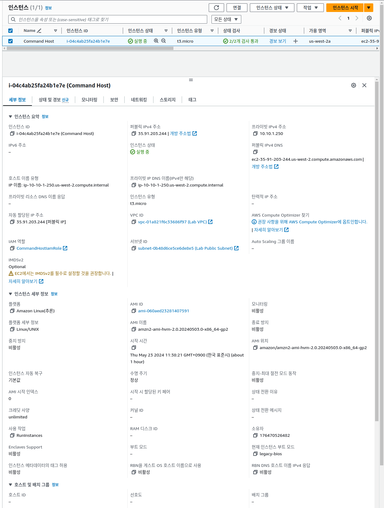
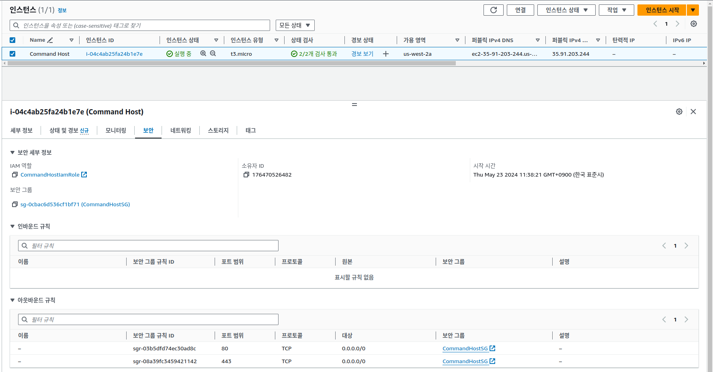
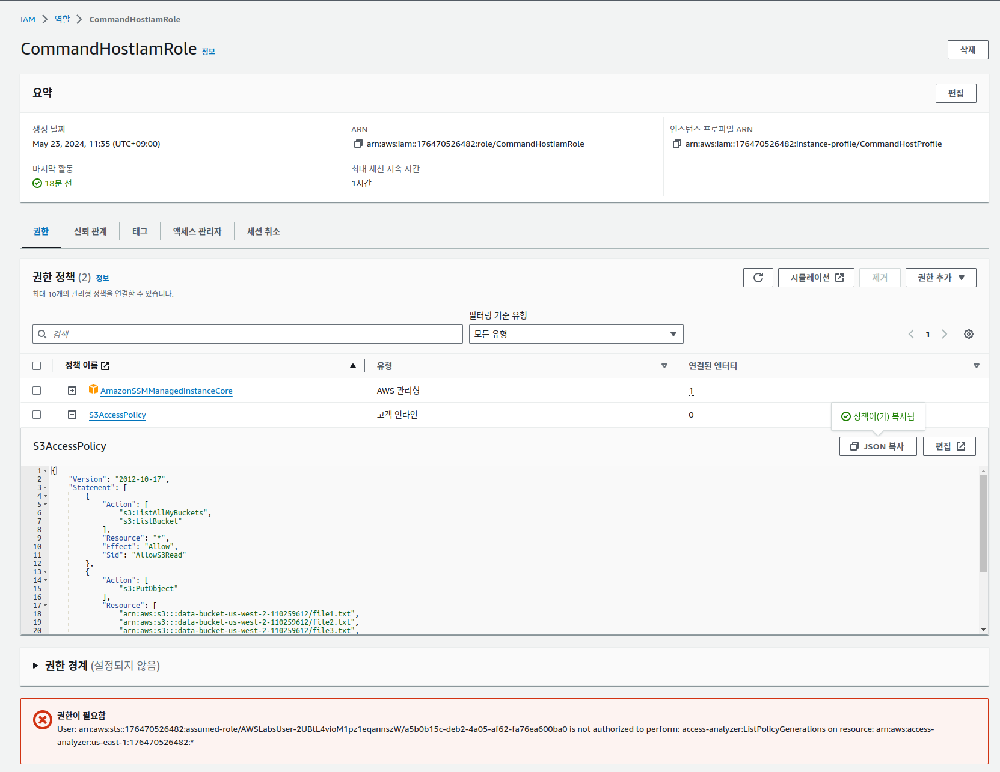
```json
{
    "Version": "2012-10-17",
    "Statement": [
        {
            "Action": [
                "s3:ListAllMyBuckets",
                "s3:ListBucket"
            ],
            "Resource": "*",
            "Effect": "Allow",
            "Sid": "AllowS3Read"
        },
        {
            "Action": [
                "s3:PutObject"
            ],
            "Resource": [
                "arn:aws:s3:::data-bucket-us-west-2-110259612/file1.txt",
                "arn:aws:s3:::data-bucket-us-west-2-110259612/file2.txt",
                "arn:aws:s3:::data-bucket-us-west-2-110259612/file3.txt",
                "arn:aws:s3:::data-bucket-us-west-2-110259612/file4.txt",
                "arn:aws:s3:::backup-bucket-us-west-2-110259612/file1.txt",
                "arn:aws:s3:::backup-bucket-us-west-2-110259612/file2.txt",
                "arn:aws:s3:::backup-bucket-us-west-2-110259612/file3.txt",
                "arn:aws:s3:::backup-bucket-us-west-2-110259612/file4.txt"
            ],
            "Effect": "Allow",
            "Sid": "AllowS3PutObjectToLabBuckets"
        }
    ]
}
```

이 정책은 EC2 인스턴스에 연결된 인스턴스 프로파일에 연결됩니다. 이 정책에는 다음과 같은 고유한 두 부분이 있습니다.

첫 번째 부분에서는 EC2 인스턴스가 모든 버킷과 해당 버킷의 내용을 나열할 수 있습니다.
버킷은 사용자 계정에 포함된 버킷, 공개적으로 액세스 가능한 버킷 또는 사용자가 액세스 권한을 부여한 다른 계정의 버킷일 수 있습니다.
두 번째 부분에서 EC2 인스턴스는 객체를 data-bucket 및 backup-bucket에 업로드(PutObject)할 수 있지만 file1.txt, file2.txt, file3.txt 또는 file4.txt로 객체 이름이 명명 되어야 합니다.
IAM 콘솔이 표시되는 웹 브라우저 탭을 닫고 EC2 콘솔이 있는 웹 브라우저 탭으로 돌아갑니다.

## 과제 2: EC2 인스턴스에 부여된 권한 유효성 검사
### 과제 2.1: 명령 호스트 인스턴스에 연결

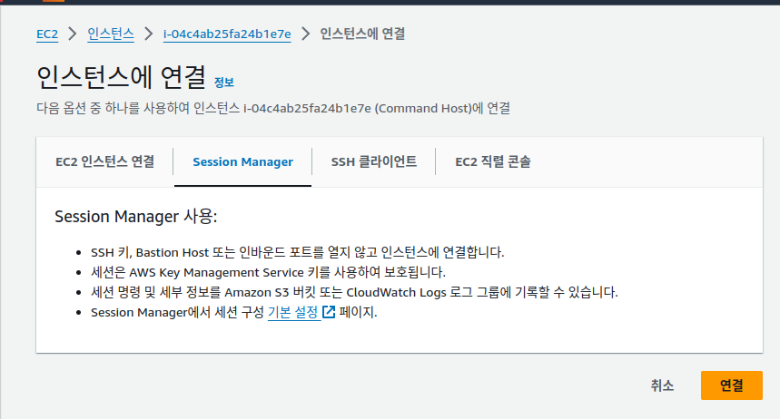

* data-bucket-us-west-2-110259612
* backup-bucket-us-west-2-110259612


```sh
cd $HOME
pwd
DataBucket=data-bucket-us-west-2-110259612
BackupBucket=backup-bucket-us-west-2-110259612
```

### 과제 2.2: 테스트에 사용되는 파일 확인
```sh
sh-4.2$ id
uid=1000(ec2-user) gid=1000(ec2-user) groups=1000(ec2-user),4(adm),10(wheel),190(systemd-journal)
sh-4.2$ pwd
/home/ec2-user/lab1
sh-4.2$ cd /home/ec2-user/lab1
sh-4.2$ ls
file1.txt  file2.txt  file3.txt  file4.txt
sh-4.2$
```
### 과제 2.3: EC2 인스턴스에 부여된 권한 테스트

다음으로, 인스턴스 프로파일과 역할을 통해 EC2 인스턴스에 연결된 S3AccessPolicy라는 IAM 정책을 테스트합니다. 인스턴스에서 AWS CLI 명령을 사용하여 승인된 작업 및 승인되지 않은 작업을 수행하고 결과를 기록해 둡니다.

 실습 환경 구축 프로세스의 일부로, Session Manager를 통해 EC2 인스턴스에 연결할 때의 기본 설정을 정의하는 AWS Systems Manager 문서 SSM-SessionManagerRunShell이 생성되었습니다. 해당 문서에서는 인스턴스에 연결할 때 명령을 실행할 수 있습니다. 이 실습에서는 명령을 더 쉽게 입력하도록 하기 위해 상호 작용하는 두 S3 버킷의 이름을 저장하는 환경 변수를 생성하는 명령이 실행됩니다. 자세한 내용은 이 실습의 마지막에 있는 추가 리소스 섹션의 AWS Systems Manager Session Manager를 참조하십시오.

S3AccessPolicy 정책 문서의 첫 번째 스테이트먼트에서는 해당 인스턴스에 대해 특정 read 작업을 부여합니다. 
* 첫 번째 작업 s3:ListAllMyBuckets에서는 인스턴스가 계정과 연결된 모든 버킷의 이름을 나열할 수 있습니다. 
* 두 번째 작업인 s3:ListBucket에서는 인스턴스가 지정된 버킷에 있는 모든 객체의 이름을 나열할 수 있습니다. 다음은 예상되는 해당 스테이트먼트가 어떤 형태인지를 생각나게 하는 내용입니다.

```sh
sh-4.2$ aws s3 ls
2023-03-03 13:13:05 awslabs-resources-krxqqla59sui8d-us-east-1-176470526482
2024-01-26 17:32:21 awslabs-resources-r5b3y6ojjszcap-us-east-1-176470526482
2024-05-23 02:36:24 backup-bucket-us-west-2-110259612
2024-05-23 02:36:24 data-bucket-us-west-2-110259612
sh-4.2$
```

```sh
sh-4.2$ aws s3 ls $DataBucket

An error occurred (NoSuchBucket) when calling the ListObjectsV2 operation: The specified bucket does not exist
sh-4.2$
```
* data-bucket-us-west-2-110259612
* backup-bucket-us-west-2-110259612

```sh
sh-4.2$ aws s3 cp /home/ec2-user/lab1/file1.txt s3://$DataBucket
upload: lab1/file1.txt to s3://data-bucket-us-west-2-110259612/file1.txt
sh-4.2$

sh-4.2$ aws s3 ls $DataBucket
2024-05-23 04:14:43         61 file1.txt
sh-4.2$
```
```sh
sh-4.2$ aws s3 cp /home/ec2-user/lab1/file1.txt s3://$BackupBucket
upload: lab1/file1.txt to s3://backup-bucket-us-west-2-110259612/file1.txt
sh-4.2$ aws s3 ls $BackupBucket
2024-05-23 04:16:07         61 file1.txt
sh-4.2$
```
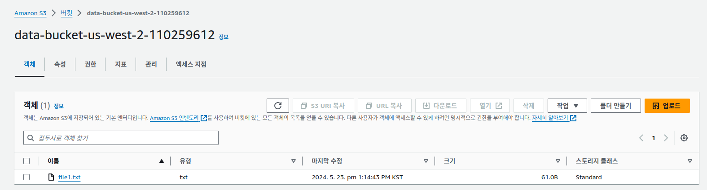

```sh
sh-4.2$ aws s3 rm s3://$DataBucket/file1.txt
delete failed: s3://data-bucket-us-west-2-110259612/file1.txt An error occurred (AccessDenied) when calling the DeleteObject operation: Access Denied
sh-4.2$
```

## 과제 3: 리소스 기반 정책을 S3 버킷에 적용하여 파일 업로드 거부

### 과제 3.1: S3 버킷 정책 생성
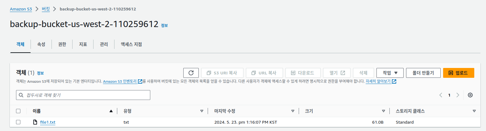

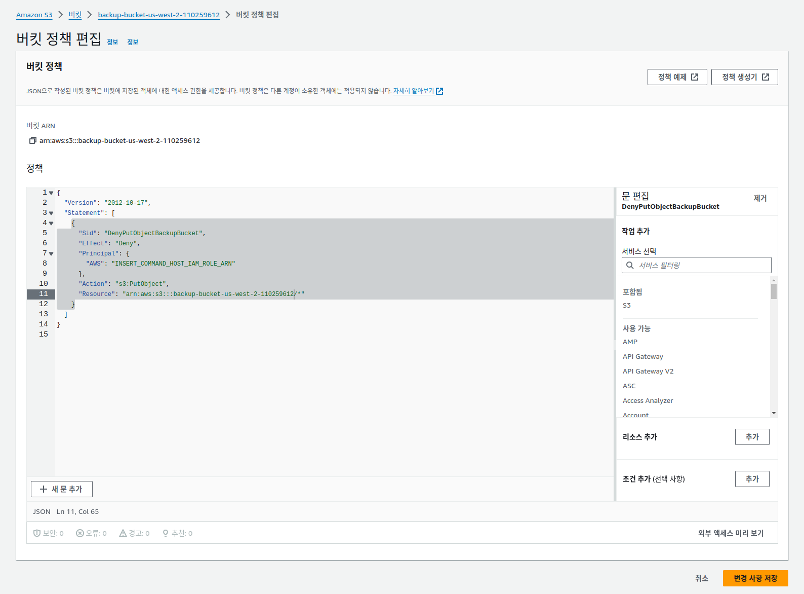

```json
{
  "Version": "2012-10-17",
  "Statement": [
    {
      "Sid": "DenyPutObjectBackupBucket",
      "Effect": "Deny",
      "Principal": {
        "AWS": "arn:aws:iam::176470526482:role/CommandHostIamRole"
      },
      "Action": "s3:PutObject",
      "Resource": "arn:aws:s3:::backup-bucket-us-west-2-110259612/*"
    }
  ]
}
```
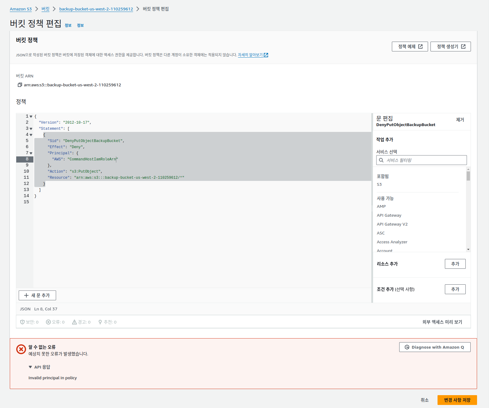
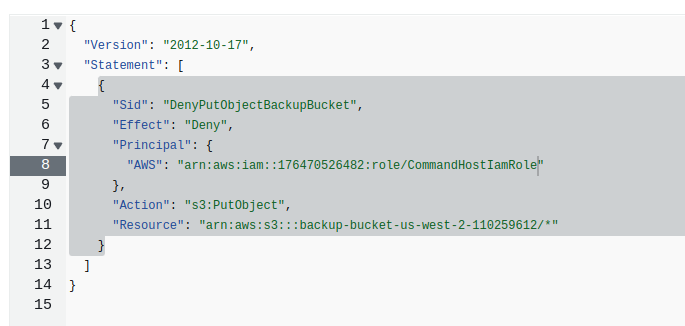


### 과제 3.2: 버킷 정책의 효과 검증

```sh
sh-4.2$ cd lab1/
sh-4.2$ ls
file1.txt  file2.txt  file3.txt  file4.txt
sh-4.2$
sh-4.2$
sh-4.2$ aws s3 cp file2.txt s3://$DataBucket
upload: ./file2.txt to s3://data-bucket-us-west-2-110259612/file2.txt
sh-4.2$ aws s3 ls $DataBucket
2024-05-23 04:14:43         61 file1.txt
2024-05-23 04:27:05         61 file2.txt
sh-4.2$
sh-4.2$
sh-4.2$
sh-4.2$ aws s3 cp file2.txt s3://$BackupBucket
upload failed: ./file2.txt to s3://backup-bucket-us-west-2-110259612/file2.txt An error occurred (AccessDenied) when calling the PutObject operation: Access Denied
sh-4.2$
sh-4.2$ aws s3 ls $BackupBucket
2024-05-23 04:16:07         61 file1.txt
```

## 과제 4: IAM 권한 경계 적용
### 과제 4.1: IAM 권한 경계 생성

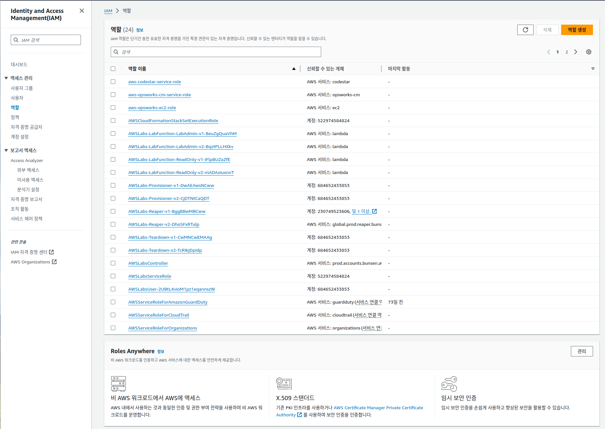

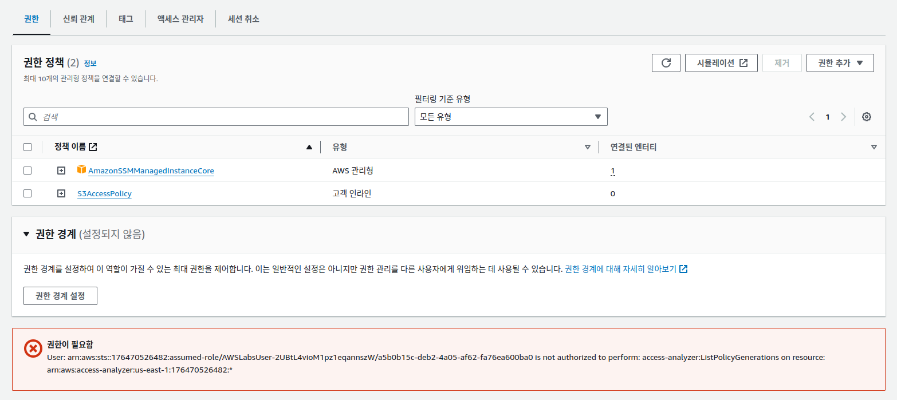

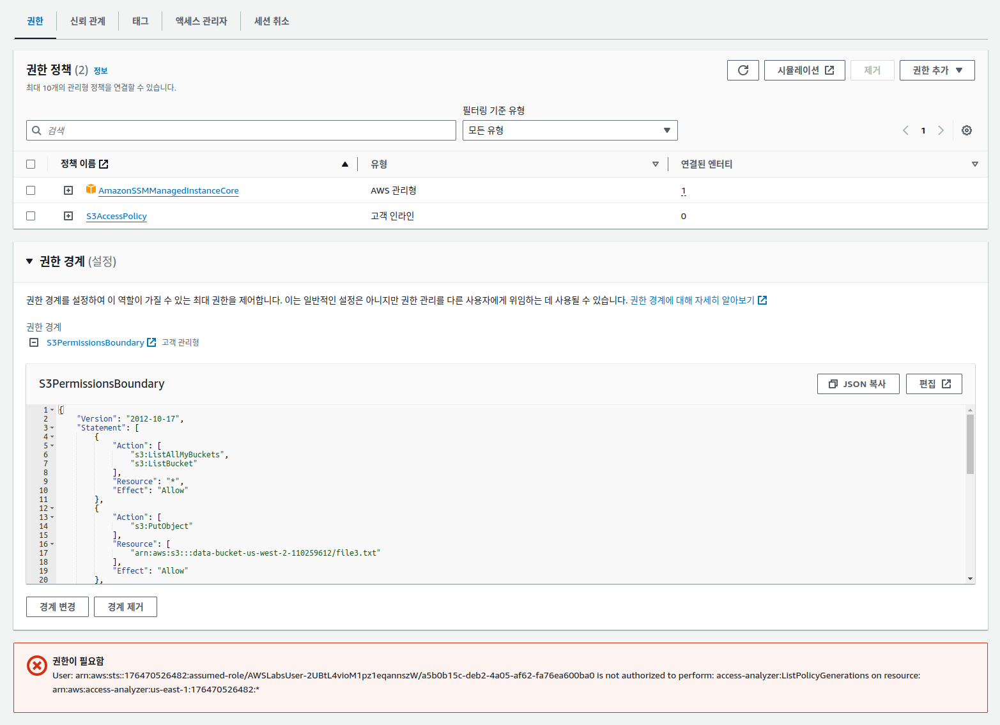

### 과제 4.2: 권한 경계의 효과 검증

```sh

sh-4.2$ cd $HOME
sh-4.2$ pwd
/home/ec2-user
sh-4.2$ DataBucket=data-bucket-us-west-2-110259612
sh-4.2$ BackupBucket=backup-bucket-us-west-2-110259612
sh-4.2$
sh-4.2$
sh-4.2$ aws s3 cp file3.txt s3://$DataBucket


The user-provided path file3.txt does not exist.
sh-4.2$
sh-4.2$ ls
lab1
sh-4.2$ cd lab1
sh-4.2$ ls
file1.txt  file2.txt  file3.txt  file4.txt
sh-4.2$ aws s3 cp file3.txt s3://$DataBucket
upload: ./file3.txt to s3://data-bucket-us-west-2-110259612/file3.txt

sh-4.2$ aws s3 ls $DataBucket

2024-05-23 04:14:43         61 file1.txt
2024-05-23 04:27:38         61 file2.txt
2024-05-23 04:37:32         61 file3.txt
sh-4.2$
sh-4.2$

sh-4.2$ aws s3 cp file4.txt s3://$DataBucket
upload failed: ./file4.txt to s3://data-bucket-us-west-2-110259612/file4.txt An error occurred (AccessDenied) when calling the PutObject operation: Access Denied
sh-4.2$

```