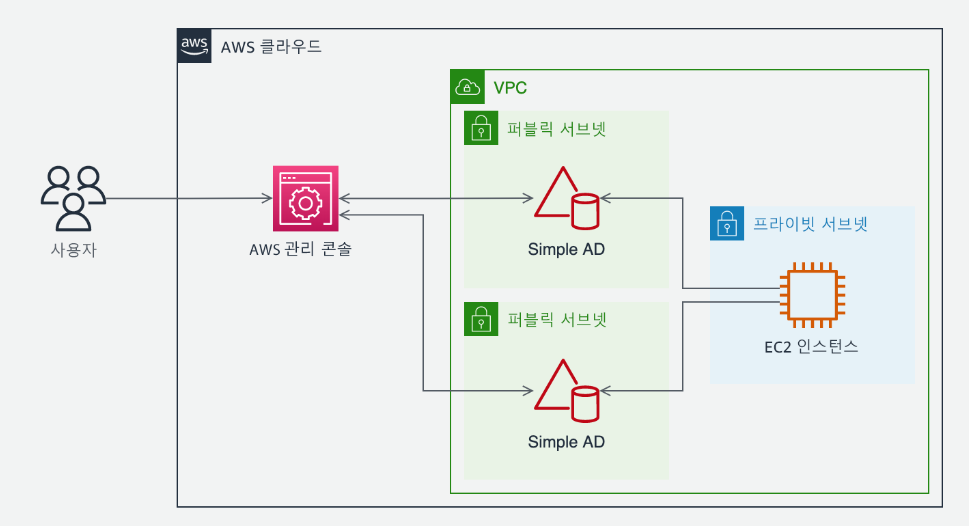
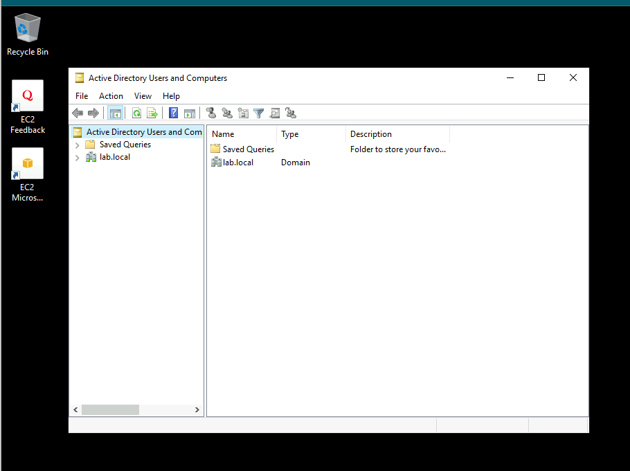
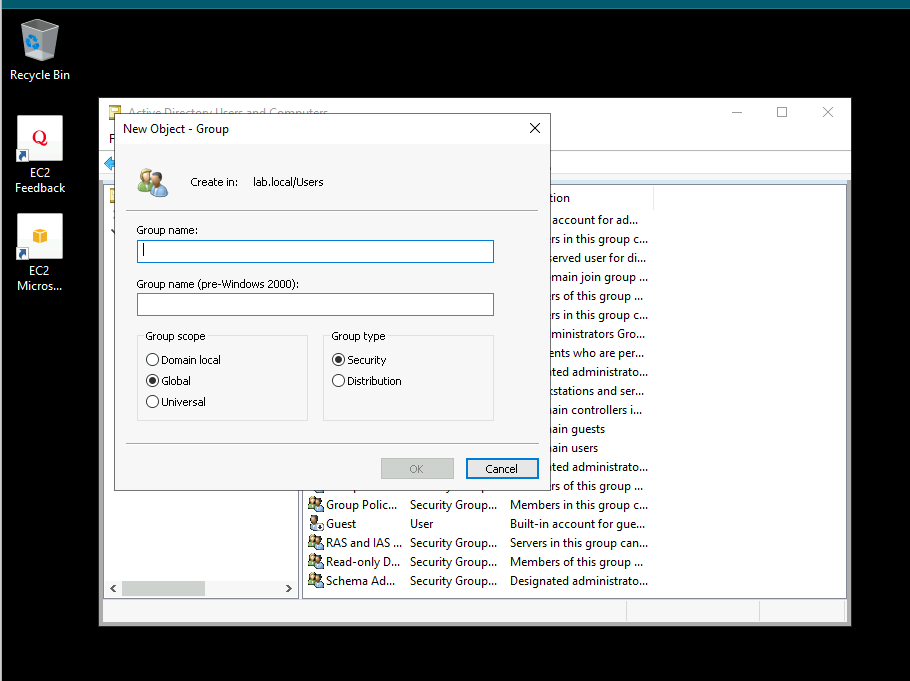
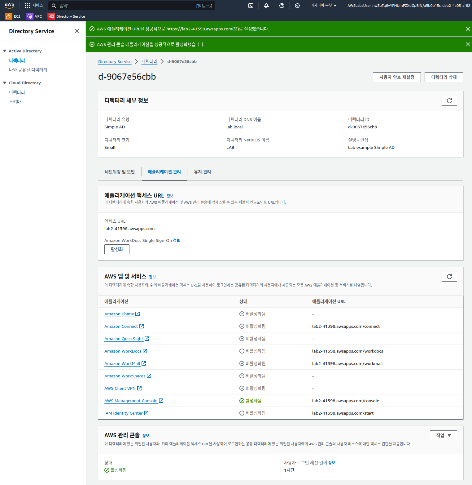
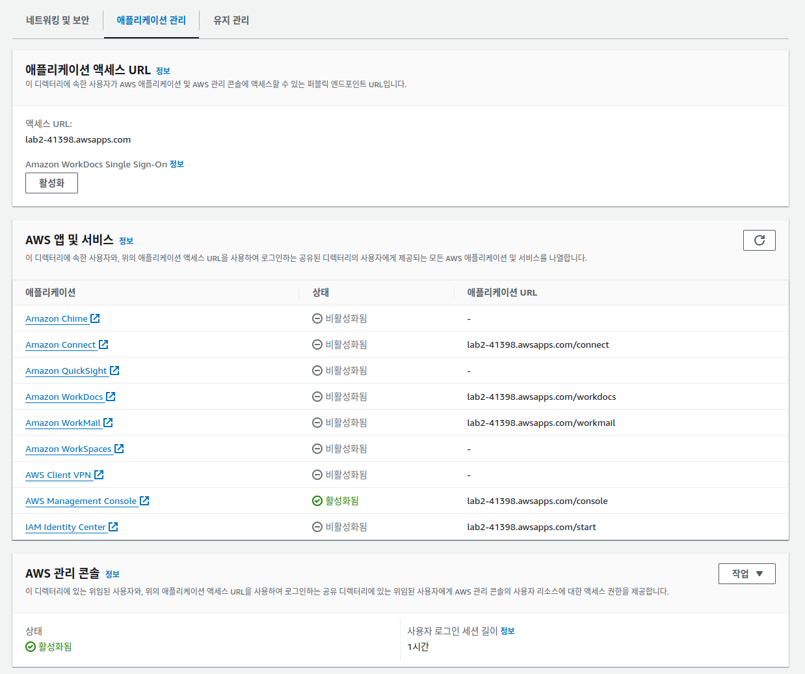
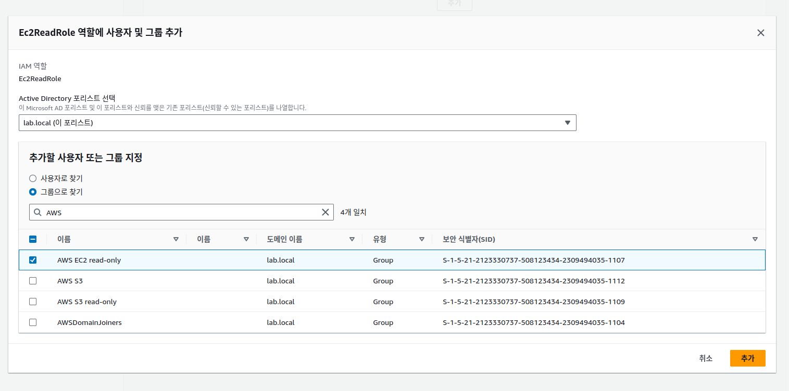
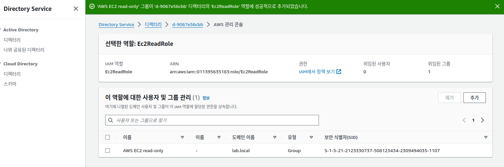
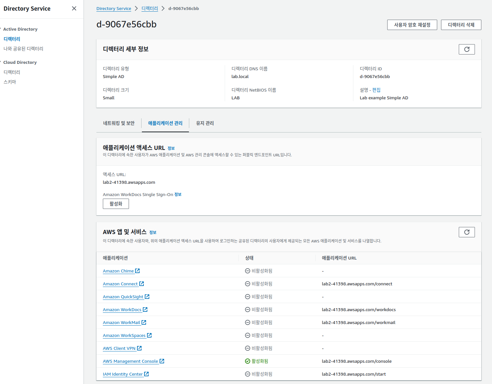
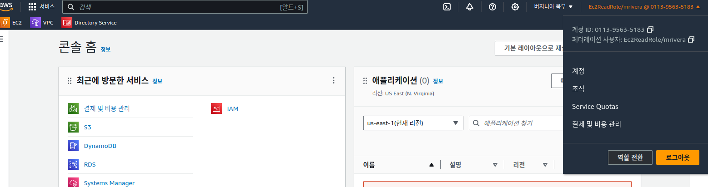

여러분은 AnyCompany의 보안 엔지니어로서 IAM 사용자 목록을 유지할 필요 없이 회사 직원들이 회사 자격 증명으로 AWS 관리 콘솔에 로그인할 수 있게 하려고 합니다. 
* 특정 직무 역할만 AWS 관리 콘솔과 상호 작용하도록 허용되며 해당 권한은 일별 태스크를 수행하는 데 필요한 최소 권한으로 제한해야 합니다. 
시작하려면 두 가지 유형의 역할을 생성할 수 있습니다. 
* 하나는 인프라 관리 팀이 Amazon Elastic Compute Cloud(Amazon EC2) 인스턴스를 볼 수 있도록 허용하는 역할이고 
* 다른 하나는 스토리지 관리자가 Amazon Simple Storage Service(Amazon S3) 버킷을 관리할 수 있도록 허용하는 역할입니다. 
사용자가 회사 정책을 위반한 것이 확인될 경우 해당 액세스 권한을 빠르게 제거하려고 할 수 있습니다.

## 태스크 1: Simple AD 디렉터리에 사용자 추가

### 태스크 1.1: WINDOWS 기반 EC2 인스턴스에 연결

### 태스크 1.2: 디렉터리 사용자 및 그룹 생성

## 태스크 2: 디렉터리 사용자를 IAM 역할에 연결

## 태스크 3: AWS 관리 콘솔에 대한 디렉터리 사용자 액세스 권한 확인

### 태스크 3.1: EC2READROLE 액세스 확인

lab2-41398.awsapps.com/console

### 태스크 3.2: S3READROLE 액세스 확인

## 태스크 4: 악의적인 사용자에 대한 액세스 거부

### 그룹에서 사용자 제거

### 사용자가 AWS 관리 콘솔에 더 이상 로그인할 수 없는지 확인