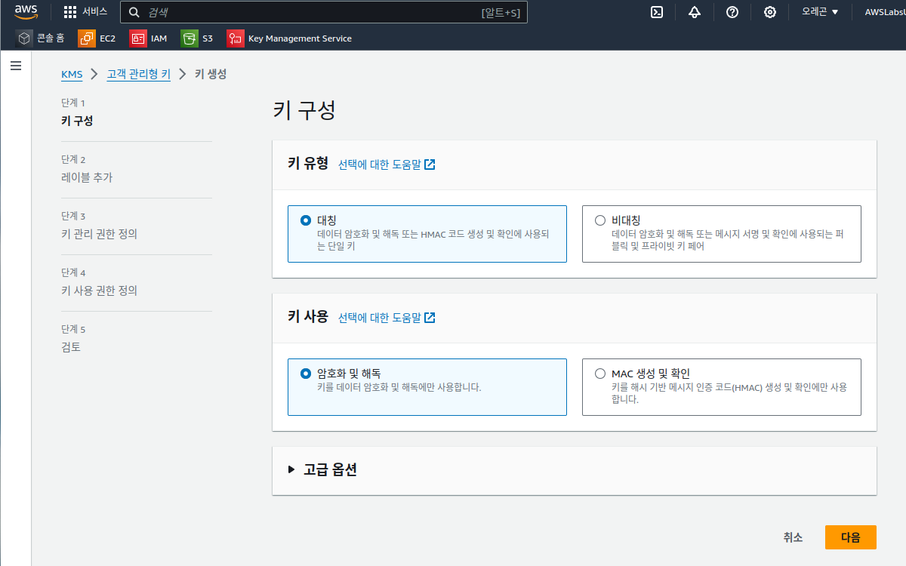
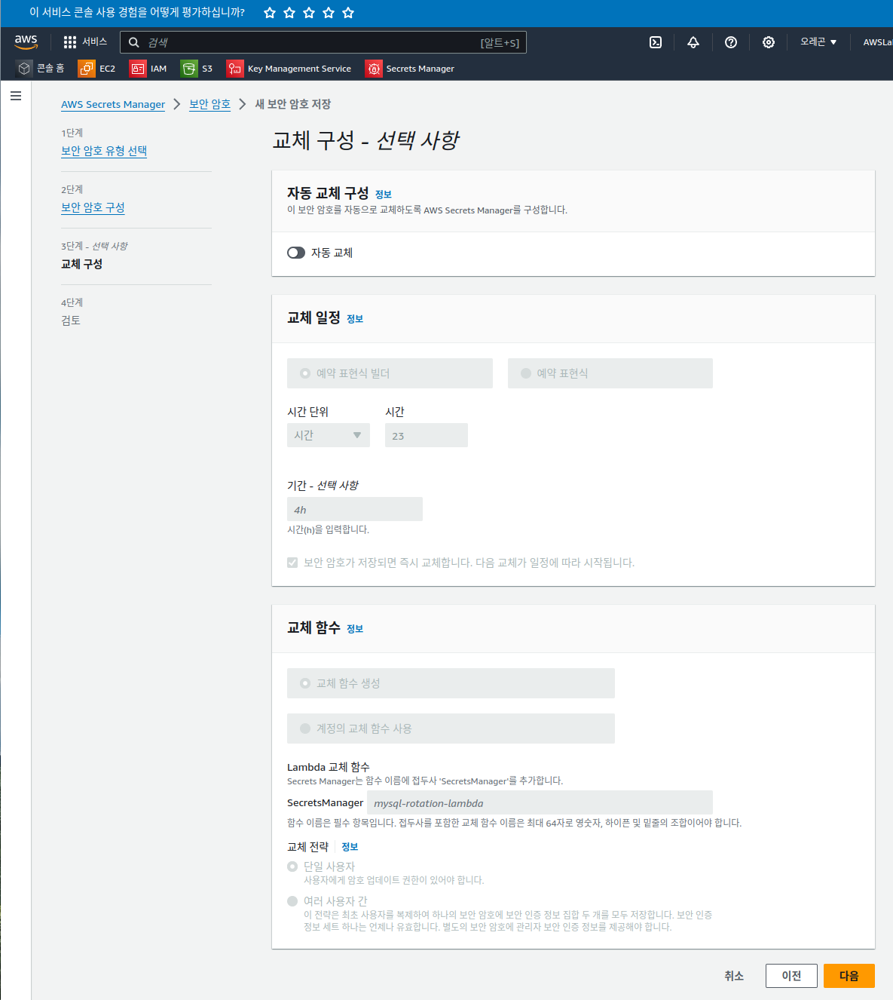

# 실습 3: AWS KMS를 사용하여 Secrets Manager 보안 암호 암호화

## 태스크 1: 보안 암호를 사용하여 Amazon RDS 데이터베이스에 액세스할 수 있는지 확인

```sh
sh-4.2$ pwd
/home/ec2-user
sh-4.2$ ls
sh-4.2$
sh-4.2$ mysql -u dbadmin -p -h  rds-instance.cwbrks54ebci.us-west-2.rds.amazonaws.com
Enter password:
Welcome to the MariaDB monitor.  Commands end with ; or \g.
Your MySQL connection id is 599
Server version: 8.0.32 Source distribution

Copyright (c) 2000, 2018, Oracle, MariaDB Corporation Ab and others.

Type 'help;' or '\h' for help. Type '\c' to clear the current input statement.

MySQL [(none)]>
MySQL [(none)]> use labdb
Reading table information for completion of table and column names
You can turn off this feature to get a quicker startup with -A

Database changed
MySQL [labdb]>
MySQL [labdb]> select * from colors;
+--------+-------------+
| Color  | Example     |
+--------+-------------+
| blue   | sky         |
| blue   | blueberries |
| blue   | Blue Jay    |
| orange | pumpkin     |
| orange | carrot      |
| orange | turmeric    |
| black  | charcoal    |
| black  | cat         |
| black  | ant         |
+--------+-------------+
9 rows in set (0.01 sec)

MySQL [labdb]>
```


## 태스크 2: AWS KMS 키 생성





## 태스크 3: AWS Secrets Manager 보안 암호를 생성하고 AWS KMS 키로 암호화





```go
// Use this code snippet in your app.
// If you need more information about configurations or implementing the sample code, visit the AWS docs:   
// https://aws.github.io/aws-sdk-go-v2/docs/getting-started/

import (
	"context"
	"log"

	"github.com/aws/aws-sdk-go-v2/aws"
	"github.com/aws/aws-sdk-go-v2/config"
	"github.com/aws/aws-sdk-go-v2/service/secretsmanager"
)

func main() {
	secretName := "dbadmin_secret"
	region := "us-west-2"

	config, err := config.LoadDefaultConfig(context.TODO(), config.WithRegion(region))
	if err != nil {
		log.Fatal(err)
	}

	// Create Secrets Manager client
	svc := secretsmanager.NewFromConfig(config)

	input := &secretsmanager.GetSecretValueInput{
		SecretId:     aws.String(secretName),
		VersionStage: aws.String("AWSCURRENT"), // VersionStage defaults to AWSCURRENT if unspecified
	}

	result, err := svc.GetSecretValue(context.TODO(), input)
	if err != nil {
		// For a list of exceptions thrown, see
		// https://docs.aws.amazon.com/secretsmanager/latest/apireference/API_GetSecretValue.html
		log.Fatal(err.Error())
	}

	// Decrypts secret using the associated KMS key.
	var secretString string = *result.SecretString

	// Your code goes here.
}
```

## 태스크 4: 암호화된 보안 암호를 사용하여 Amazon RDS 인스턴스에 연결


```sh
cd $HOME; pwd
sh-4.2$ cd $HOME; pwd
/home/ec2-user
sh-4.2$ aws secretsmanager get-secret-value --secret-id dbadmin_secret
{
    "ARN": "arn:aws:secretsmanager:us-west-2:737833037758:secret:dbadmin_secret-euKBIS",
    "Name": "dbadmin_secret",
    "VersionId": "c76df649-fef6-481d-9035-f8625dd43ee7",
    "SecretString": "{\"username\":\"dbadmin\",\"password\":\"iQRObeCqmIMPae9o6a0C\",\"engine\":\"mysql\",\"host\":\"lab-rds-cluster.cluster-cwbrks54ebci.us-west-2.rds.amazonaws.com\",\"port\":3306,\"dbClusterIdentifier\":\"lab-rds-cluster\"}",
    "VersionStages": [
        "AWSCURRENT"
    ],
    "CreatedDate": "2024-05-23T08:26:53.362000+00:00"
}
sh-4.2$
```

 보안: 할당된 IAM 인스턴스 프로파일에 보안 암호 및 연결된 KMS 키에 액세스하기 위한 적절한 IAM 정책이 있으므로 이 EC2 인스턴스에서 aws secretsmanager get-secret-value 명령을 실행할 수 있습니다. 프로덕션 환경에서는 항상 보안 암호와 상호 작용해야 할 수 있는 모든 사용자 또는 AWS 서비스에 대해 최소 권한을 적용해야 합니다.

특히 관심 있는 보안 암호 부분은 SecretString 속성의 JSON 문자열 일부로 저장되는 암호입니다. 해당 암호를 복사하고 데이터베이스에 수동으로 연결하는 데 사용할 수 있지만 암호를 프로그래밍 방식으로 검색하고 애플리케이션에 전달하는 여러 방법이 있습니다.

 AWS Secrets Manager에서 보안 암호를 검색하는 데 관한 자세한 내용은 이 실습 끝에 있는 추가 리소스 섹션에서 AWS Secrets Manager에서 보안 암호 검색을 참조하십시오.

이 실습에서는 jq 유틸리티를 사용하여 보안 암호 값에서 특정 정보를 구문 분석한 다음, 구문 분석한 정보를 데이터베이스에 연결하는 셸 스크립트를 생성합니다.

```sh
cat<<'EOF'>> get-secret.sh
getsecretvalue() {
  aws secretsmanager get-secret-value --secret-id $1 | \
    jq .SecretString | \
    jq fromjson
}

secret=`getsecretvalue $1`

user=$(echo $secret | jq -r .username)
password=$(echo $secret | jq -r .password)
endpoint=$(echo $secret | jq -r .host)
port=$(echo $secret | jq -r .port)

mysql \
-p$password \
-u $user \
-P $port \
-h $endpoint
EOF
```


```sh

sh-4.2$ sh  ./get-secret.sh dbadmin_secret
Welcome to the MariaDB monitor.  Commands end with ; or \g.
Your MySQL connection id is 662
Server version: 8.0.32 Source distribution

Copyright (c) 2000, 2018, Oracle, MariaDB Corporation Ab and others.

Type 'help;' or '\h' for help. Type '\c' to clear the current input statement.

MySQL [(none)]>

MySQL [(none)]> use labdb;
Reading table information for completion of table and column names
You can turn off this feature to get a quicker startup with -A

Database changed
MySQL [labdb]>
MySQL [labdb]>
MySQL [labdb]>
MySQL [labdb]> select * from colors;
+--------+-------------+
| Color  | Example     |
+--------+-------------+
| blue   | sky         |
| blue   | blueberries |
| blue   | Blue Jay    |
| orange | pumpkin     |
| orange | carrot      |
| orange | turmeric    |
| black  | charcoal    |
| black  | cat         |
| black  | ant         |
+--------+-------------+
9 rows in set (0.01 sec)

MySQL [labdb]>

```


## 태스크 5: 보안 암호를 순환하고 Amazon RDS 인스턴스에 다시 연결

### 태스크 5.1: 보안 암호 순환 구성


### 태스크 5.2: 보안 암호 순환 함수가 AWS KMS 키에 액세스하기 위한 권한 부여


### 태스크 5.4: 업데이트된 보안 암호을 사용하여 데이터베이스에 연결

```sh
sh-4.2$ mysql -u dbadmin -p -h  rds-instance.cwbrks54ebci.us-west-2.rds.amazonaws.com
Enter password:
Welcome to the MariaDB monitor.  Commands end with ; or \g.
Your MySQL connection id is 732
Server version: 8.0.32 Source distribution

Copyright (c) 2000, 2018, Oracle, MariaDB Corporation Ab and others.

Type 'help;' or '\h' for help. Type '\c' to clear the current input statement.

MySQL [(none)]>
```

