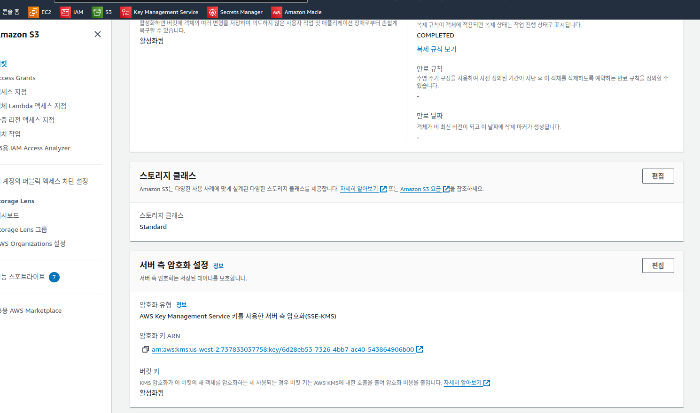

## 과제 1: 기본 및 보조 리전에 AWS KMS 키 생성

### 과제 1.1: 기본 및 보조 리전 버킷 식별


* original-bucket-123945895	미국 서부(오레곤) us-west-2
* replication-bucket-123945895	미국 서부(캘리포니아 북부) us-west-1

### 과제 1.2: 기본 리전 AWS KMS 키 생성


* arn:aws:kms:us-west-2:737833037758:key/6d28eb53-7326-4bb7-ac40-543864906b00

### 과제 1.3: 보조 리전 AWS KMS 키 생성


## 과제 2: AWS KMS 키를 사용하여 S3 버킷의 데이터 암호화
이 과제에서는 해당하는 리전 AWS KMS 키를 사용하도록 기본 및 보조 리전 버킷 둘 다에서 기본 암호화를 설정합니다. 이렇게 하면 버킷의 기본 암호화를 사용하여 업로드한 객체가 자동으로 암호화됩니다. S3 버킷에 대해 암호화를 설정한 후에 샘플 파일을 업로드하여 테스트합니다.

### 과제 2.1: 해당 AWS KMS 키를 사용하여 각 버킷에서 기본 암호화 사용


### 과제 2.2: 샘플 파일을 원본 버킷으로 업로드하여 암호화 설정 확인


## 과제 3: 승인되지 않은 암호화 방법 및 키를 사용하는 S3 객체 업로드 방지
이전 과제에서 원본 버킷에 대해 기본 암호화를 사용하도록 설정하고, 특정 AWS KMS 키(original-kms-key)에서 SSE-KMS를 사용하도록 암호화 유형을 설정하고, 샘플 파일을 업로드하여 확인했습니다.

이 과제에서는 비규격 업로드를 방지하는 버킷 정책을 구성함으로써 원본 버킷에 객체 업로드를 적용하여 특정 서버 측 암호화 키 유형 및 AWS KMS 키를 사용합니다.

### 과제 3.1: 샘플 파일을 업로드하여 기본 암호화 재정의


즉, 버킷의 기본 암호화는 객체를 업로드하는 동안 암호화를 적용하지 않으며 업로드 동안 설정을 재정의할 수 있습니다.

### 과제 3.2: 원본 버킷에서 특정 AWS KMS 키로 암호화를 적용하는 S3 버킷 정책 생성

보안 규칙에 따르면 지정된 AWS KMS 키(이 시나리오에서는 original-kms-key)를 사용하지 않는 경우 모든 업로드를 거부해야 합니다. 다음 요구 사항을 적용하도록 버킷 정책을 설정해야 합니다.


```json
{
    "Version": "2012-10-17",
    "Statement": [
      {
                "Sid": "Deny Incorrect AWS KMS Keys or encryption key types",
                "Effect": "Deny",
                "Principal": "*",
                "Action": "s3:PutObject",
                "Resource": "arn:aws:s3:::original-bucket-123945895/*",
                "Condition": {
                    "StringNotEquals": {
                          "s3:x-amz-server-side-encryption-aws-kms-key-id": "arn:aws:kms:us-west-2:737833037758:key/6d28eb53-7326-4bb7-ac40-543864906b00"
                             }
                   }
           }
    ]
}

```


### 과제 3.3 버킷 정책 확인


 예상 출력:

Upload without setting extra encryption options: 버킷에서 AWS KMS original-kms-key가 기본 옵션으로 설정되었으며 버킷 정책의 키와 일치하므로 업로드가 성공적으로 수행됩니다.

Upload with SSE-KMS and using AWS managed key (aws/s3): 버킷 정책에 구성된 키(original-kms-key)가 사용되지 않으므로 업로드가 실패합니다.

## 과제 4: Macie를 사용하여 S3 버킷의 객체에 저장된 개인 식별 정보(PII) 식별
회사의 데이터 보호 전략의 일부로 적용해야 하는 마지막 보안 컨트롤은 S3 객체에서 PII를 감지하는 것입니다.

이 과제에서 PII를 포함할 수 있는 모든 객체에서 S3 버킷 객체를 찾고 결과를 생성하도록 Macie 작업을 구성합니다. 이 작업은 원본 버킷에만 적용됩니다.

### 과제 4.1: MACIE 활성화


### 과제 4.2: MACIE 역할 암호 해독 권한을 허용하도록 AWS 키 정책 수정

다음 섹션에서 Macie 작업을 생성하면 Macie 서비스가 S3 객체를 검사합니다. 객체가 암호화되었으므로 검사하기 전에 객체를 암호 해독하도록 Macie 서비스를 허용해야 합니다. 이 작업을 수행하려면 Macie 서비스 역할에 대한 KMS 키 정책에 암호를 해독하기 위한 명시적 권한을 추가합니다.


```json
{
    "Version": "2012-10-17",
    "Statement": [
        {
            "Sid": "Enable IAM User Permissions",
            "Effect": "Allow",
            "Principal": {
                "AWS": "arn:aws:iam::737833037758:root"
            },
            "Action": "kms:*",
            "Resource": "*"
        },
        {"Sid": "Enable explicit permissions for Macie service-role",
        "Effect": "Allow",
        "Principal": {
            "AWS":
                "arn:aws:iam::737833037758:role/aws-service-role/macie.amazonaws.com/AWSServiceRoleForAmazonMacie"
        },
        "Action": "kms:Decrypt",
        "Resource": "*"
        }
    ]
}
```

### 과제 4.3: 원본 버킷 객체를 검사하는 MACIE 작업 생성


Macie 작업을 완료하는 데 약 10~15분이 소요되므로 다음 작업을 완료한 후 결과를 검토하게 됩니다.

## 과제 5: 재해 복구 리전 버킷으로 데이터 복제
이 과제에서 기본 리전의 가능한 데이터 손실로부터 보호하기 위해 원본 버킷에 업로드된 암호화된 객체를 재해 복구 리전의 복제 버킷으로 복제하는 복제 규칙을 생성합니다.

일단 데이터가 복제되면 보조 리전 AWS KMS 키 replication-kms-key를 사용하여 암호화됩니다.

이 목표를 달성하기 위해서는 다음 단계를 완료해야 합니다.

* 두 버킷에서 버킷 버전 관리 사용
* 원본 버킷에서 복제 버킷으로 객체를 복제하도록 복제 규칙 구성
* 객체 복제 권한이 있는 서비스 역할이 필요합니다. 복제 규칙을 생성할 때 서비스 역할이 자동으로 생성됩니다.
* 원본 버킷으로 객체를 업로드하여 복제를 확인합니다.

### 과제 5.1: 두 버킷에서 버킷 버전 관리 사용


### 과제 5.2: 복제 규칙 구성


### 과제 5.3: 원본 버킷으로 객체를 업로드하여 복제를 테스트합니다.





## 과제 6: Macie 작업 결과 확인


완료
 축하합니다! 지금까지 다음 작업을 완료했습니다.

S3 버킷에서 사용할 AWS KMS 키를 생성했습니다.
AWS KMS 키를 사용하여 S3 버킷의 데이터를 암호화했습니다.
업로드된 객체에 대해 암호화를 적용하는 S3 버킷 정책을 생성했습니다.
S3 버킷의 암호화된 객체를 다른 리전의 버킷에 복제하는 S3 복제 규칙을 생성했습니다.
Macie를 사용하여 S3 버킷의 객체에 저장된 개인 식별 정보(PII)를 식별했습니다.

