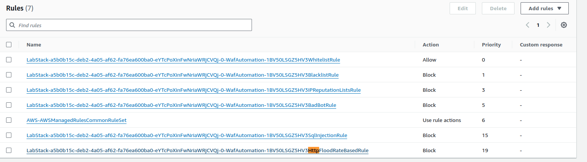

# 실습 5: AWS WAF를 사용하여 악성 트래픽 완화
이 실습에서는 웹 애플리케이션에 대한 다양한 위협을 완화하기 위해 WAF Automation on AWS을 구현합니다. 먼저 WAF Automation on AWS CloudFormation 템플릿이 생성하는 리소스를 식별합니다. 그런 다음 웹 애플리케이션에 대한 서비스 거부 및 SQL 명령어 삽입 공격을 시뮬레이션하고 보안 자동화의 대응 방식을 검토합니다.

목표
본 실습을 마치면 다음을 할 수 있습니다.

WAF Automation on AWS CloudFormation 템플릿이 배포한 리소스를 식별합니다.
WAF Automation on AWS를 사용하여 서비스 거부 및 SQL 명령어 삽입 공격을 완화합니다.
WAF Automation on AWS 구성이 의도한 대로 수행되는지 확인합니다.


## 태스크 1: WAF Automation on AWS CloudFormation 템플릿이 생성한 리소스를 검토합니다.


### 태스크 1.1: CLOUDFORMATION의 리소스 목록 검토


### 태스크 1.2: CLOUDFORMATION 템플릿이 생성한 WAF 리소스 검토





```json
{
  "Name": "LabStack-a5b0b15c-deb2-4a05-af62-fa76ea600ba0-eYTcPoXinFwNriaWRjCVQj-0-WafAutomation-1BV50LSGZ5HV3HttpFloodRateBasedRule",
  "Priority": 19,
  "Statement": {
    "RateBasedStatement": {
      "Limit": 100,
      "EvaluationWindowSec": 300,
      "AggregateKeyType": "IP"
    }
  },
  "Action": {
    "Block": {}
  },
  "VisibilityConfig": {
    "SampledRequestsEnabled": true,
    "CloudWatchMetricsEnabled": true,
    "MetricName": "LabStacka5b0b15cdeb24a05af62fa76ea600ba0eYTcPoXinFwNriaWRjCVQj0WafAutomation1BV50LSGZ5HV3HttpFloodRateBasedRule"
  }
}
```


## 태스크 2: HTTP 플러드 방지 검토

### 태스크 2.1: HTTP 요청으로 웹 사이트 플러딩 시도

https://us-west-2.console.aws.amazon.com/systems-manager/session-manager/i-0f50d519672fe5987

* instanceSessioonUrl:  https://us-west-2.console.aws.amazon.com/systems-manager/session-manager/i-0f50d519672fe5987

```sh
cd $HOME; pwd; AlbUrl="https://us-west-2.console.aws.amazon.com/systems-manager/session-manager/i-0f50d519672fe5987"
azonaws.com"HOME; pwd; AlbUrl="http://web-server-alb-1780870724.us-west-2.elb.am
/home/ec2-user
sh-4.2$ cd $HOME; pwd; AlbUrl="https://us-west-2.console.aws.amazon.com/systems-manager/session-manager/i-0f50d519672fe5987"
/home/ec2-user

cat <<EOF > loop.sh
#!/bin/bash

runtime="3 minute"
endtime=\$(date -ud "\$runtime" +%s)
totaltime=0

while [[ \$(date -u +%s) -le \$endtime ]]
do
    curl -I "$AlbUrl/?[1-100]" | grep HTTP
    echo "sleeping for 10 seconds"
    echo "total time running = \$totaltime seconds"
    ((totaltime=totaltime+10))
    sleep 10
done
EOF


sh-4.2$ ls
loop.sh

sh-4.2$ cat loop.sh
#!/bin/bash

runtime="3 minute"
endtime=$(date -ud "$runtime" +%s)
totaltime=0

while [[ $(date -u +%s) -le $endtime ]]
do
    curl -I "https://us-west-2.console.aws.amazon.com/systems-manager/session-manager/i-0f50d519672fe5987/?[1-100]" | grep HTTP
    echo "sleeping for 10 seconds"
    echo "total time running = $totaltime seconds"
    ((totaltime=totaltime+10))
    sleep 10
done
```

### 태스크 2.2: 애플리케이션 로드 밸런서를 AWS WAF 웹 ACL에서 리소스로 추가


### 태스크 2.3: HTTP 플러드 공격 다시 시도


 웹 애플리케이션을 보호하기 위해 AWS WAF 속도 기반 규칙을 사용에 대한 자세한 내용은 추가 리소스 섹션의 블로그 게시물: The three most important AWS WAF rate-based rules를 참조하십시오.

Ctrl+C를 눌러 스크립트 실행을 중지합니다.
 축하합니다! WAF Automation on AWS 규칙이 HTTP 플러드 공격으로부터 웹 사이트를 보호하는 방법을 성공적으로 시연했습니다.

## 태스크 3: SQL 명령어 삽입 보호 검사

### 태스크 3.1: 데이터베이스 API에 대한 SQL 명령어 삽입 공격 시도

* https://nhqj37zoed.execute-api.us-west-2.amazonaws.com/Dev?id==1


* https://nhqj37zoed.execute-api.us-west-2.amazonaws.com/Dev?id=1 or 1=1


### 태스크 3.2: API를 AWS WAF 웹 ACL에서 리소스로 추가


### 태스크 3.3: SQL 명령어 삽입 공격 다시 시도


AWS WAF용 보안 자동화 규칙이 SQL 주입 공격으로부터 API와 데이터베이스를 어떻게 보호하는지 성공적으로 시연했습니다.  참고: WAF 규칙이 적용되는 데 약 1~2분이 소요될 수 있습니다. forbidden 메시지가 표시되지 않으면 1분 동안 기다렸다가 다시 시도하십시오. 페이지 하드 새로 고침을 수행하려면 Shift를 누른 상태에서 웹 브라우저의 새로 고침 버튼을 선택해야 할 수도 있습니다.


==>


완료
 축하합니다! 지금까지 다음 작업을 완료했습니다.

WAF Automation on AWS CloudFormation 템플릿을 배포했습니다.
WAF Automation on AWS를 사용하여 서비스 거부 및 SQL 명령어 삽입 공격을 완화했습니다.
WAF Automation on AWS 구성이 의도한 대로 수행되는지 확인했습니다.