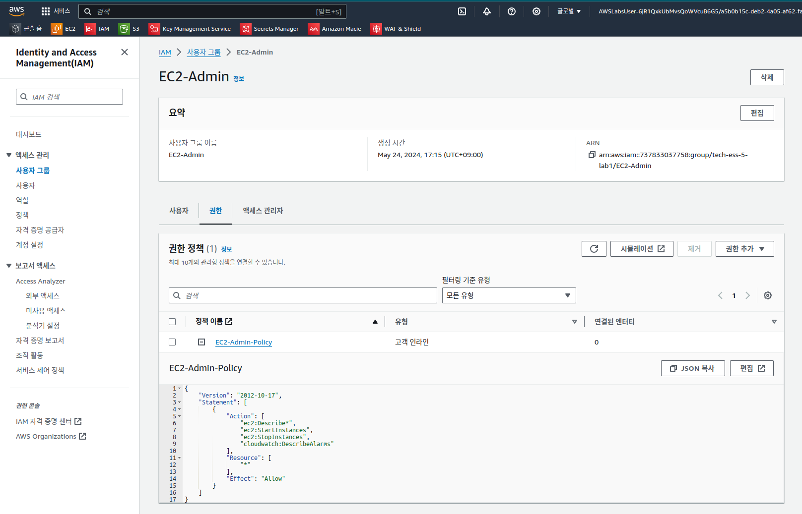
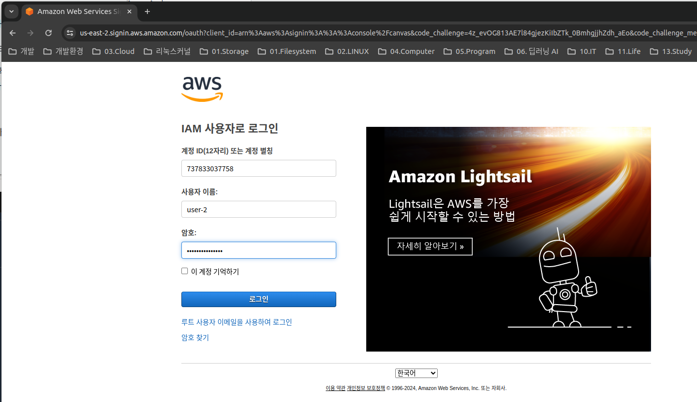

# 실습 1: IAM 소개


## 과제 1: IAM 살펴보기
### 과제 1.1: IAM 사용자, 그룹 및 정책 살펴보기


```json
{
    "Version": "2012-10-17",
    "Statement": [
        {
            "Effect": "Allow",
            "Action": [
                "s3:Get*",
                "s3:List*",
                "s3:Describe*",
                "s3-object-lambda:Get*",
                "s3-object-lambda:List*"
            ],
            "Resource": "*"
        }
    ]
}
```

정책은 특정 AWS 리소스에 대해 허용 또는 차단된 작업을 정의합니다. 이 정책은 EC2, Elastic Load Balancing, Amazon CloudWatch 및 Auto Scaling에 대한 정보를 나열하고 설명할 수 있는 권한을 부여합니다. 지원 역할 정책 적용 시에는 일반적으로 액세스 권한이 읽기 전용 수준으로 제한되므로 AWS 리소스를 수정할 수 없습니다.

아래 목록에 IAM 정책의 기본 구조가 대략적으로 설명되어 있습니다.

* Effect는 권한을 Allow할지 아니면 Deny할지를 나타냅니다.
* Action은 특정 AWS 서비스에 대해 허용되는 API 호출(예: cloudwatch:ListMetrics)을 지정합니다.
* Resource는 해당 정책 규칙이 적용되는 엔터티의 범위를 정의합니다. 예를 들어 특정 Amazon S3 버킷이나 Amazon EC2 인스턴스를 정의할 수도 있고 
/* 를 사용하여 모든 리소스를 지정할 수도 있습니다.





### 과제 1.2: 사용자 및 그룹 관리
Amazon Web Services 사용 범위가 갈수록 확대되고 있는 회사가 있습니다. 이 회사는 여러 Amazon EC2 인스턴스와 대량의 Amazon S3 스토리지를 사용합니다. 다음 표에 나와 있는 직무에 따라 신입 사원들에게 액세스 권한을 부여하려고 합니다.

사용자	그룹	권한
user-1	S3-Support	Amazon S3에 대한 읽기 전용 액세스
user-2	EC2-Support	Amazon EC2에 대한 읽기 전용 액세스
user-3	EC2-Admin	Amazon EC2 인스턴스 보기, 시작 및 중지


## 과제 2: IAM 로그인 URL 사용
### 과제 2.1: IAM 로그인 URL 찾기 및 액세스


* https://737833037758.signin.aws.amazon.com/console

### 과제 2.2: 여러 IAM 사용자로 로그인


### USER-2로 로그인




### USER-3로 로그인


실습 완료
 축하합니다! 이제 다음을 수행할 수 있습니다.

IAM 사용자 및 그룹 살펴보기
그룹에 적용된 IAM 정책 검사
그룹에 사용자를 추가하는 실제 시나리오 진행 및 그룹 권한 살펴보기
IAM 로그인 URL 찾기 및 사용
다양한 정책 및 서비스 액세스 방식 적용해 보기
