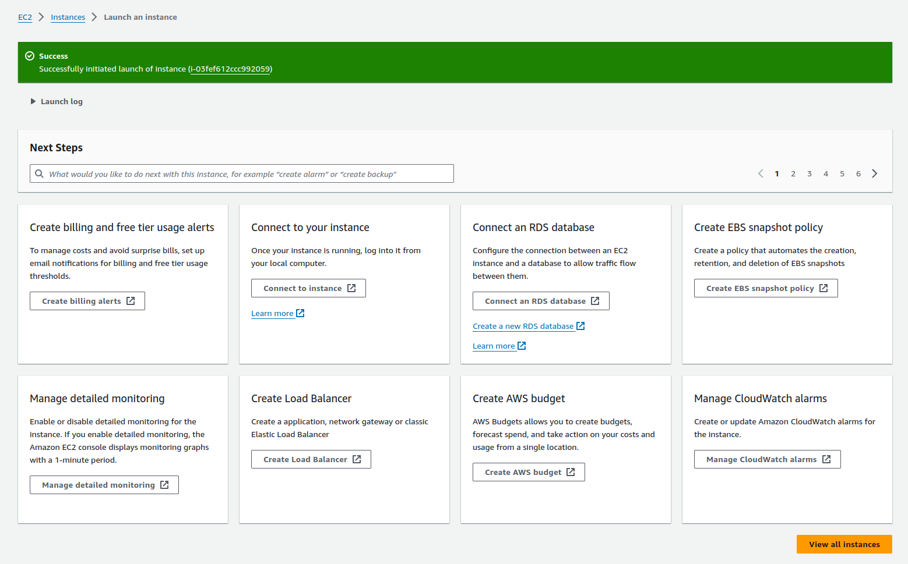

# 실습 2: VPC 생성 및 Amazon EC2 인스턴스에서 웹 애플리케이션 시작

Amazon Virtual Private Cloud(Amazon VPC)를 사용하면 정의한 논리적으로 격리된 가상 네트워크에서 AWS 리소스를 시작할 수 있습니다.

목표
이 실습을 완료하면 다음을 수행할 수 있습니다.

* 퍼블릭 서브넷 2개가 포함된 새 Amazon VPC 생성
* 인터넷 게이트웨이 생성
* 인터넷으로의 퍼블릭 경로가 포함된 라우팅 테이블 생성
* 보안 그룹 생성
* Amazon Elastic Compute Cloud(Amazon EC2) 인스턴스 시작
* 사용자 데이터 스크립트를 사용하여 웹 애플리케이션을 호스팅하도록 
* EC2 인스턴스 구성

## 과제 1: Virtual Private Cloud 생성


이 과제에서는 VPC, 인터넷 게이트웨이, 인터넷으로의 퍼블릭 경로가 포함된 라우팅 테이블을 생성하며 가용 영역(AZ) 2개에 퍼블릭 서브넷 2개를 생성합니다.

Amazon Virtual Private Cloud(Amazon VPC)를 사용하면 사용자가 정의한 가상 네트워크에서 AWS 리소스를 시작할 수 있습니다. 이 가상 네트워크는 자체 데이터 센터에서 운영하는 기존 네트워크와 매우 유사하며 AWS의 확장 가능한 인프라를 사용한다는 이점이 있습니다.

인터넷 게이트웨이는 수평적으로 확장되고 이중화를 지원하는 고가용성 VPC 구성 요소로, VPC와 인터넷 간 통신을 허용합니다. 인터넷 게이트웨이는 IPv4 및 IPv6 트래픽을 지원합니다. 따라서 네트워크 트래픽에 가용성 위험이나 대역폭 제약이 발생하지 않습니다.

VPC를 생성한 후 서브넷을 추가합니다. 각 서브넷은 가용 영역 하나 안에만 포함되어 있어야 하며 여러 가용 영역에 분산되어 있을 수는 없습니다. 서브넷은 VPC 내의 IP 주소 범위입니다. 지정된 서브넷으로 AWS 리소스를 시작할 수 있습니다. 인터넷에 연결되어야 하는 리소스에는 퍼블릭 서브넷을 사용하고, 인터넷에 연결되지 않는 리소스에는 프라이빗 서브넷을 사용하십시오. 이 실습에서는 프라이빗 서브넷을 사용하지 않습니다.

### 과제 1.1: VPC, 퍼블릭 서브넷, 라우팅 테이블 및 인터넷 게이트웨이 생성


### 과제 1.2: 라우팅 테이블에 퍼블릭 경로 추가


## 과제 2: VPC 보안 그룹 생성


## 과제 3: Amazon EC2 인스턴스 시작


```sh
#!/bin/bash -ex

# Update yum
yum -y update

#Install nodejs
yum -y install nodejs

# Create a dedicated directory for the application
mkdir -p /var/app

# Get the app from S3
wget https://aws-tc-largeobjects.s3-us-west-2.amazonaws.com/ILT-TF-100-TECESS-5/app/app.zip

# Extract it to the desired folder
unzip app.zip -d /var/app/
cd /var/app/

# Install dependencies
npm install

# Start the app
npm start
```




* 18.231.143.147


실습 완료
 축하합니다! 이제 다음을 수행할 수 있습니다.

퍼블릭 서브넷 2개가 포함된 새 Amazon VPC 생성
인터넷 게이트웨이 생성
인터넷으로의 퍼블릭 경로가 포함된 라우팅 테이블 생성
보안 그룹 생성
Amazon Elastic Compute Cloud(Amazon EC2) 인스턴스 시작
사용자 데이터 스크립트를 사용하여 웹 애플리케이션을 호스팅하도록 EC2 인스턴스 구성
