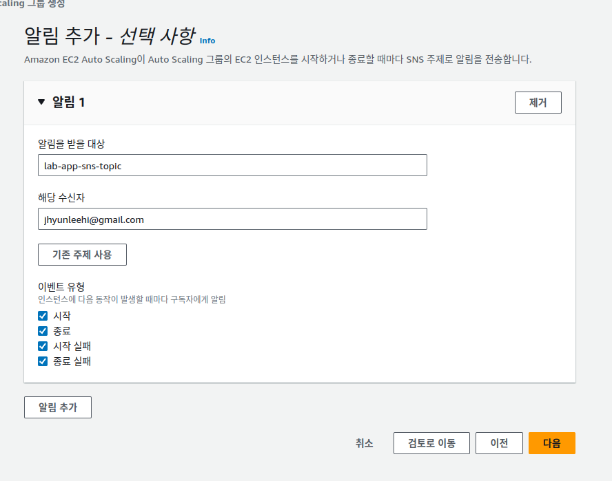

# 실습 4: 애플리케이션 고가용성 구성

* Amazon Elastic Compute Cloud(Amazon EC2) 인스턴스와 웹 애플리케이션 검토 및 구성 확인
* Application Load Balancer 및 시작 템플릿 생성
* Amazon EC2 Auto Scaling 그룹 설정
* 템플릿 시작
* 웹 애플리케이션을 스트레스 테스트하여 크기 조정 확인


## 과제 1: EC2 인스턴스와 웹 애플리케이션을 검토하여 구성 확인
실습을 지원하기 위해 일부 리소스가 미리 프로비저닝되어 있습니다. 이러한 리소스에는 VPC, 인터넷 게이트웨이, 각기 다른 가용 영역에 있는 퍼블릭 서브넷 2개, 인터넷으로의 경로가 포함된 라우팅 테이블, 보안 그룹, 버킷 정책이 적용된 Amazon Simple Storage Service(Amazon S3) 버킷, DynamoDB 테이블, EC2 인스턴스, 그리고 인스턴스가 Amazon S3 및 Amazon DynamoDB에 액세스하려면 필요한 권한이 있는 IAM 역할이 포함됩니다.


## 과제 2: Application Load Balancer 생성


* ARN: arn:aws:elasticloadbalancing:ca-central-1:429893242685:loadbalancer/app/Web-Application-ALB/35bd48f16015f97e
* DNS:  Web-Application-ALB-2101551139.ca-central-1.elb.amazonaws.com


## 과제 3: 시작 템플릿 생성


*  Amazon EC2는 퍼블릭 키 암호화 기법을 사용하여 로그인 정보를 암호화하고 복호화합니다. 인스턴스에 로그인하려면 키 페어를 만들고, 인스턴스를 실행할 때 키 페어의 이름을 지정하고, 인스턴스에 연결할 때 프라이빗 키를 제공해야 합니다.
*  


* EmployeeDirectoryAppRole

```sh
#!/bin/bash -ex

# Update yum
yum -y update

#Install nodejs
yum -y install nodejs

#Install stress tool (for load balancing testing)
yum -y install stress

# Create a dedicated directory for the application
mkdir -p /var/app

# Get the app from Amazon S3
wget https://aws-tc-largeobjects.s3-us-west-2.amazonaws.com/ILT-TF-100-TECESS-5/app/app.zip

# Extract it into a desired folder
unzip app.zip -d /var/app/
cd /var/app/

# Configure S3 bucket details
export PHOTOS_BUCKET=labstack-a5b0b15c-deb2-4a05-af62-fa76-imagesbucket-woug42w5glap

# Configure default AWS Region
export DEFAULT_AWS_REGION=ca-central-1

# Enable admin tools for stress testing
export SHOW_ADMIN_TOOLS=1

# Install dependencies
npm install

# Start your app
npm start
```


```json
{
    "Version": "2012-10-17",
    "Statement": [
        {
            "Action": ["dynamodb:ListTables"],
            "Resource": ["arn:aws:dynamodb:ca-central-1:429893242685:table/*"],
            "Effect": "Allow"
        },
        {
            "Action": ["dynamodb:PutItem","dynamodb:DeleteItem","dynamodb:UpdateItem","dynamodb:Scan"],
            "Resource": ["arn:aws:dynamodb:ca-central-1:429893242685:table/Employees"],
            "Effect": "Allow"
        }
    ]
}
```

```json
{
    "Version": "2012-10-17",
    "Statement": [
        {
            "Action": ["s3:PutObject","s3:DeleteObject"],
            "Resource": ["arn:aws:s3:::labstack-a5b0b15c-deb2-4a05-af62-fa76-imagesbucket-woug42w5glap"],
            "Effect": "Allow"
        }
    ]
}
```

```json
{
    "Version": "2012-10-17",
    "Statement": [
        {
            "Condition": {"StringEquals": {"ec2:osuser": "ec2-user"}},
            "Action": ["ec2-instance-connect:SendSSHPublicKey"],
            "Resource": ["arn:aws:ec2:*:*:instance/*"],
            "Effect": "Allow"
        }
    ]
}
```


## 과제 4: Auto Scaling 그룹 생성


Auto Scaling 그룹은 논리적 단위로 처리되는 Amazon EC2 인스턴스의 모음입니다. 그룹 및 해당 인스턴스에 대한 설정을 구성하고, 그룹의 최소, 최대 및 원하는 용량을 정의합니다. 서로 다른 최소 및 최대 용량 값을 설정하면 그룹의 경계가 형성되어 애플리케이션의 로드가 수요에 따라 크게 높아지거나 낮아질 때 그룹을 크기 조정할 수 있습니다. Auto Scaling 그룹을 크기 조정하려면 원하는 용량으로 수동 조정하거나 Amazon EC2 Auto Scaling에서 수요의 변화를 충족하도록 용량을 자동으로 추가 및 제거할 수 있도록 합니다.

인스턴스 플릿을 시작할 때 온디맨드 인스턴스가 충족해야 하는 용량의 비율과 스팟 인스턴스가 충족해야 하는 비율을 지정하여 EC2 비용을 최대 90% 절감할 수 있습니다. Amazon EC2 Auto Scaling을 사용하면 가용 영역에서 용량을 프로비저닝하고 크기 조정하여 가용성을 최적화할 수 있습니다. 또한 수명 주기 후크, 인스턴스 상태 확인 및 예약된 크기 조정 기능을 통해 용량 관리를 자동화할 수 있습니다.





## 과제 5: 애플리케이션 테스트


