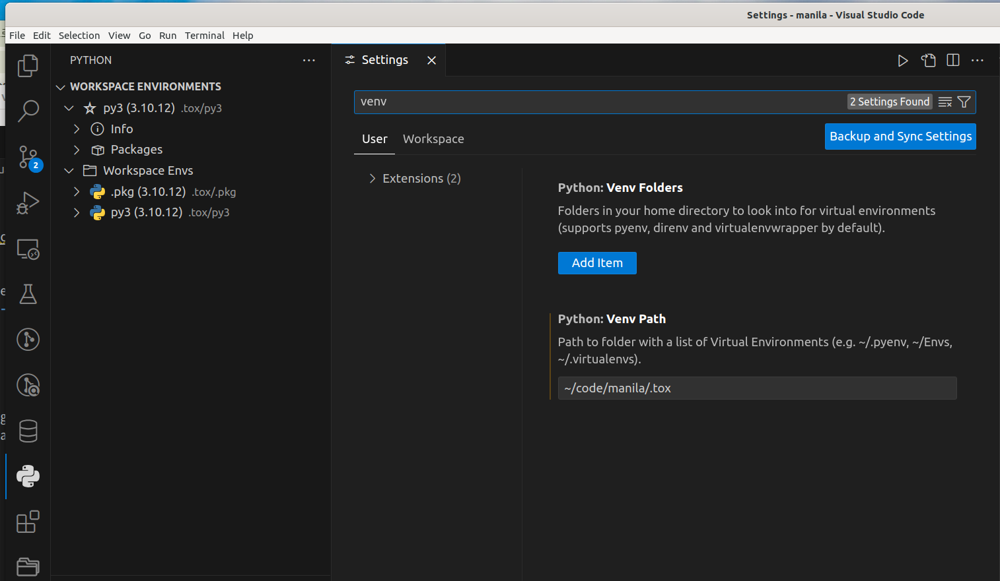

https://docs.openstack.org/manila/latest/contributor/index.html#basic-information

Manually installing and using the virtualenv
--------------------------------------------

You can also manually install the virtual environment::

  tox -epy36 --notest

This will install all of the Python packages listed in the
``requirements.txt`` file into your virtualenv.

To activate the Manila virtualenv you can run::

     $ source .tox/py36/bin/activate

To exit your virtualenv, just type::

     $ deactivate

Or, if you prefer, you can run commands in the virtualenv on a case by case
basis by running::

     $ tox -e venv -- <your command>

