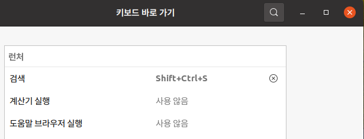

# Ubuntu Set up

## xrdp

### install

```
sudo apt install ubuntu-desktop
sudo adduser xrdp ssl-cert
sudo ufw allow from 192.168.2.0/24 to any port 3389
sudo ufw reload
sudo ufw status
```

#### ubuntu 20 xrdp 색상관리자 인증 메세지

/etc/polkit-1/localauthority/50-local.d
디렉터리로 가서 (없으면 생성)

45-allow-colord.pkla 라는 파일을 만들고,

```
[Allow Colord all Users]
Identity=unix-user:*
Action=org.freedesktop.color-manager.create-device;org.freedesktop.color-manager.create-profile;org.freedesktop.color-manager.delete-device;org.freedesktop.color-manager.delete-profile;org.freedesktop.color-manager.modify-device;org.freedesktop.color-manager.modify-profile
ResultAny=no
ResultInactive=no
ResultActive=yes

[Allow Package Management all Users]
Identity=unix-user:*
Action=org.debian.apt.*;io.snapcraft.*;org.freedesktop.packagekit.*;com.ubuntu.update-notifier.*
ResultAny=no
ResultInactive=no
ResultActive=yes
```

#### xrdp와 share  설정

* xrdp 잘 안되면 share 설정하라고 하는데... 설정안해도 잘된다.


#### ubuntu 22 xrdp 재설치

##### 1. remove xrdp

```sh
sudo systemctl disable xrdp
sudo systemctl stop xrdp

sudo apt purge xrdp
sudo apt purge xserver-xorg-core
sudo apt purge xserver-xorg-input-all
sudo apt purge xorgxrdp
```

##### 2. reinstall

```sh
sudo apt install xrdp
sudo apt install xserver-xorg-core
sudo apt install xserver-xorg-input-all
sudo apt install xorgxrdp
```

You also need to grant access to the **/etc/ssl/private/ssl-cert-snakeoil.key** file for **xrdp** user. It is available to members of the **ssl-cert** group by default.

```sh
$ sudo adduser xrdp ssl-cert           # add xrdp into ssl-cert group
$ sudo systemctl start xrdp            # start xrdp service
$ systemctl is-active xrdp             # check xrdp state
...
active
$ sudo systemctl enable xrdp           # start xrdp on system start
$ sudo ufw allow 3389
$ sudo ufw allow from 10.5.5.0/24 to any port 3389
```

##### 3. 주의 사항

* xrpd 접속하는 GUI 계정은 별도로 유지하면 아무런 문제가 없다.

* 동일 한 유저로 콘솔에서 GUI로 로그인하고 xrdp로 로그인하면  한쪽이 멈춰 버린다.
* 이때는 `$ sudo  systemctl restart gdm` 해서 다시 시작한다.

#### gonme-desktop 재설치

```
sudo apt-get install gnome-shell ubuntu-gnome-desktop
```
#### 시행 착오
*  root로 접속해 본다, 
* 일반 사용자를 adduser 해서 xrdp 접속해본다. 
* 특정 user 만 접속이 안될때... 
* 일반 사용자 잘 접속되면 아무래도 안되는 사용자 설정에 문제가 있을 수 있으므로 user 데이터 백업 받고 삭제한다음 user 다시 만드는 방법도 해결책이 될 수 있다.  
* 일단 linux의 console에서 접속해서 share관련된 것을 enable 시킨다.  
* 아래와 같이 /var/log/xrdp.log에 나오는 것을 정상이다. 괞이 힘빼지 말자. 
```

[20230415-21:51:35] [INFO ] Socket 12: AF_INET6 connection received from ::ffff:192.168.100.2 port 4539
[20230415-21:51:35] [INFO ] Using default X.509 certificate: /etc/xrdp/cert.pem
[20230415-21:51:35] [INFO ] Using default X.509 key file: /etc/xrdp/key.pem
[20230415-21:51:36] [ERROR] SSL_read: I/O error
[20230415-21:51:36] [ERROR] libxrdp_force_read: header read error
[20230415-21:51:36] [ERROR] Processing [ITU-T T.125] Connect-Initial failed
[20230415-21:51:36] [ERROR] [MCS Connection Sequence] receive connection request failed
[20230415-21:51:36] [ERROR] xrdp_sec_incoming: xrdp_mcs_incoming failed
[20230415-21:51:36] [ERROR] xrdp_rdp_incoming: xrdp_sec_incoming failed
[20230415-21:51:36] [ERROR] xrdp_process_main_loop: libxrdp_process_incoming failed
[20230415-21:51:36] [ERROR] xrdp_iso_send: trans_write_copy_s failed
[20230415-21:51:36] [ERROR] Sending [ITU T.125] DisconnectProviderUltimatum failed
[20230415-21:51:36] [INFO ] Socket 12: AF_INET6 connection received from ::ffff:192.168.100.2 port 4540
[20230415-21:51:36] [INFO ] Using default X.509 certificate: /etc/xrdp/cert.pem
[20230415-21:51:36] [INFO ] Using default X.509 key file: /etc/xrdp/key.pem
[20230415-21:51:36] [INFO ] Connected client computer name: SUPER-COM
[20230415-21:51:36] [WARN ] Received [MS-RDPBCGR] TS_UD_HEADER type 0xc006 is unknown (ignored)
[20230415-21:51:36] [WARN ] Received [MS-RDPBCGR] TS_UD_HEADER type 0xc00a is unknown (ignored)
[20230415-21:51:36] [INFO ] xrdp_load_keyboard_layout: Keyboard information sent by the RDP client, keyboard_type:[0x08], keyboard_subtype:[0x00], keylayout:[0xE0010412]
[20230415-21:51:36] [INFO ] xrdp_load_keyboard_layout: model [] variant [] layout [us] options []
[20230415-21:51:36] [INFO ] TLS connection established from ::ffff:192.168.100.2 port 4540: TLSv1.2 with cipher ECDHE-RSA-AES256-GCM-SHA384
[20230415-21:51:36] [INFO ] xrdp_caps_process_pointer: client supports new(color) cursor
[20230415-21:51:36] [INFO ] xrdp_process_offscreen_bmpcache: support level 1 cache size 5242880 MB cache entries 100
[20230415-21:51:36] [INFO ] xrdp_caps_process_codecs: nscodec, codec id 1, properties len 3
[20230415-21:51:36] [WARN ] xrdp_caps_process_codecs: unknown codec id 5
[20230415-21:51:36] [INFO ] xrdp_caps_process_codecs: RemoteFX, codec id 3, properties len 49
[20230415-21:51:36] [WARN ] Cannot find keymap file /etc/xrdp/km-e0010412.ini
[20230415-21:51:36] [INFO ] Loading keymap file /etc/xrdp/km-00000412.ini
[20230415-21:51:36] [WARN ] local keymap file for 0xe0010412 found and doesn't match built in keymap, using local keymap file
[20230415-21:51:38] [INFO ] connecting to sesman ip 127.0.0.1 port 3350
[20230415-21:51:38] [INFO ] xrdp_wm_log_msg: sesman connect ok
[20230415-21:51:38] [INFO ] sesman connect ok
[20230415-21:51:38] [INFO ] sending login info to session manager, please wait...
[20230415-21:51:38] [INFO ] xrdp_wm_log_msg: login successful for display 13
[20230415-21:51:38] [INFO ] login successful for display 13
[20230415-21:51:38] [INFO ] loaded module 'libxup.so' ok, interface size 10296, version 4
[20230415-21:51:38] [INFO ] started connecting
[20230415-21:51:38] [INFO ] lib_mod_connect: connecting via UNIX socket
[20230415-21:51:38] [INFO ] lib_mod_log_peer: xrdp_pid=57376 connected to X11rdp_pid=55609 X11rdp_uid=1000 X11rdp_gid=1000 client_ip=::ffff:192.168.100.2 client_port=4540
[20230415-21:51:38] [INFO ] connected ok
```


#### xfce4 설치

* 이것도 저것도 해도 안되면 ??
xfce4 설치한다.

<https://ubunlog.com/ko/como-instalar-xfce-en-ubuntu-y-derivados/?msclkid=7f2c6ed3b57311ecb035d75d7854c63d>

``` 
# sudo apt install xfce4
# sudo apt install xubuntu-desktop
```

```
$ sudo apt-get install xrdp
$ sudo apt-get install xfce4
$ echo xfce4-session > ~/.xsession
$ vi /etc/xrdp/startwm.sh
$sudo service xrdp restart 
$ sudo apt-get install xfce4-terminal
$ sudo apt-get install gnome-icon-theme-full tango-icon theme
```

#### Ubuntu GUI restart

##### 1. gnome-shell

In this scenario we simply restart the `gnome-shell` as non-privileged user by entering the following command in terminal.

```sh
gnome-shell --replace
```

##### 2. systemd-logind

```sh
sudo systemctl restart  systemd-logind
```

##### 3. restart Display Manager

```sh
sudo  systemctl restart gdm
```

#### GUI에 root 로그인 하기

##### 1.  root passwd 설정

##### 2.  GDM configureation file

```sh
$ sudo nano /etc/gdm3/custom.conf

AllowRoot=true
```

##### 3. PAM authentication daemon configuration file

* 주석처리

```sh
$ sudo nano /etc/pam.d/gdm-password

# auth   required        pam_succeed_if.so user != root quiet_success
```

$ sudo nano /etc/gdm3/custom.conf

## user

#### group add

```
sudo groupadd foo
sudo groupadd bar
cat /etc/group
```

```
# id 명령으로 현재 설정된 id 정보나 group 정보를 알 수 있다.
$ sudo id leocat
uid=1000(leocat) gid=1000(leocat) groups=1000(leocat)

# -G 옵션으로 secondary group으로 foo 설정
$ sudo usermod -G foo leocat
$ sudo id leocat
uid=1000(leocat) gid=1000(leocat) groups=1000(leocat),10000(foo)

# -a 옵션으로 secondary group을 추가할 수 있다. (append)
$ sudo usermod -G foo -a leocat
$ sudo id leocat
uid=1000(leocat) gid=1000(leocat) groups=1000(leocat),10000(foo),10001(bar)

# 콤마(,)를 이용해서 여러 group을 지정할 수 있다.
$ sudo usermod -G foo,bar leocat
$ sudo id leocat
uid=1000(leocat) gid=1000(leocat) groups=1000(leocat),10000(foo),10001(bar)

# group을 제거하면 user에 추가되어 있던 group도 제거된다.
$ sudo groupdel bar
[leocat@my-test ~]$ sudo id leocat
uid=1000(leocat) gid=1000(leocat) groups=1000(leocat),10000(foo)
```

### 환경 설정

#### super key가 제일 중요

* super key는 윈도우키가 동작하는데 xrdp 같은 경우는 아쉬운데로 검색 기능만 별로 키로 지정하여 사용한다.
* 검색키는  shift+Ctrl+s  키를 이용하면 편리하다.




## Typora

### install

```
# or use
# wget -qO - https://typora.io/linux/public-key.asc | sudo apt-key add -
wget -qO - https://typoraio.cn/linux/public-key.asc | sudo tee /etc/apt/trusted.gpg.d/typora.asc

# add Typora's repository
sudo add-apt-repository 'deb https://typora.io/linux ./'
sudo apt-get update

# install typora
sudo apt-get install typora
```
